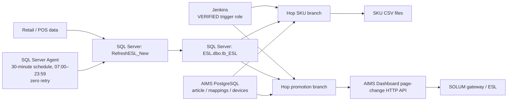
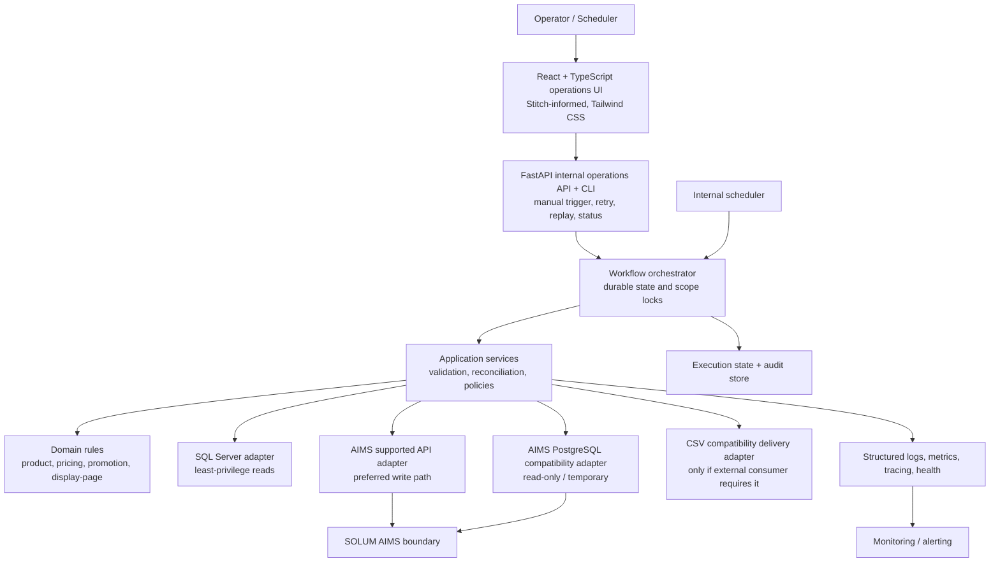

# System Architecture — SOLUM ESL / AIMS Pipeline Replacement

## 1. Architecture status and evidence

This document defines the approved target shape and records current-state evidence. It does not authorize application implementation. AIMS remains an external vendor boundary; its database layout is not a stable target contract.

## 2. Current architecture



### Verified dependency map

```text
Jenkins (job names/schedules UNKNOWN)
  ├─ esl-master-sku-updater.hpl
  │    └─ esl-sku-update-daily-new.hwf
  │         ├─ database connection check
  │         ├─ esl-compare-diff.hpl
  │         └─ esl-sku-update-to-csv.hpl
  └─ esl-master-promo-runner.hpl
       └─ esl-promo-sub-workflow-delay.hwf
            ├─ esl-sku-revert-to-normal-oos.hpl
            ├─ esl-sku-revert-to-normal-price.hpl
            └─ esl-sku-promo-multi-page.hpl
```

### Current-state inventory

| Artifact | Location | Type / purpose | Inputs / outputs | Trigger / failure handling | Class | Replacement area |
| --- | --- | --- | --- | --- | --- | --- |
| `RefreshESL_New` | `docs/sql-server/Store_Procedure_Refresh_ESL.sql` | Stored procedure builds ESL record state; latest supplied text contains Patch 2.5 promotion changes. | Three source tiers → `tb_ESL`. Same instance: `DBWH_8555` by three-part name. Remote by linked server: `PEPITO_HO` central iRetail, and one local iRetail SQL Server per store whose address comes from `DimStore.ORG_IP`/`ORG_DB` at runtime. | Procedure text has transaction/catch handling but is marked review/test only and contains an apparent direct self-invocation; safe production execution is not established. | VERIFIED source text / safe deployment NEEDS-DISCOVERY | Ingestion, rules, persistence orchestration. |
| Promotion business-rule reference | `docs/sql-server/ESL_Promotion_Business_Logic_and_Business_Rules_Reference.md` | Current compatibility baseline for promotion eligibility, pricing, UOM, selection, and audit. | Operational campaigns + supporting metadata → promotion state. | Distinguishes confirmed rules from unresolved policy. | VERIFIED | Domain-rule extraction and parity tests. |
| `Refresh ESL Data` | `docs/sql-server/job_refresh_esl.sql` | SQL Agent job executes the stored procedure. | `EXEC dbo.RefreshESL_New`. | Every 30 min, 07:00–23:59 daily; zero retries; step fails job. | VERIFIED | Scheduler/retry replacement. |
| `tb_ESL` DDL | `docs/sql-server/tb_ESL_DDL.sql` | Legacy ESL data store. | Product/price/stock/promo record. | Existing table/indexes. | VERIFIED | **Parity baseline only.** The replacement reads the same three source tiers the procedure reads and writes its own PostgreSQL; it neither writes `tb_ESL` nor treats it as an input. The table is read only to compare legacy output against computed canonical records under `ESL_SHADOW_MODE`. |
| Discount troubleshooting report | `docs/sql-server/...Discount_Mismatch...md` | Business-rule evidence and risks. | Case study. | N/A. | VERIFIED | Rule-discovery baseline. |
| `esl-master-sku-updater.hpl` | Hop backup | SKU master entry pipeline. | `tb_ESL` stores → workflow. | Jenkins asserted by runbook. | VERIFIED / INFERRED trigger | Scheduling/orchestration. |
| `esl-sku-update-daily-new.hwf` | Hop backup | SKU DB check, diff, export. | SQL/AIMS reads → CSV. | Abort on child/check failure. | VERIFIED | SKU workflow. |
| `esl-compare-diff.hpl` | Hop backup | Compares source and AIMS article fields. | `tb_ESL`, AIMS `article` → changed item list. | No retry found. | VERIFIED | Diff/reconciliation rule. |
| `esl-sku-update-to-csv.hpl` | Hop backup | Exports new/changed SKU CSV. | Diff list + SQL → file. | Legacy consumer identity unknown; target automated acknowledgement contract approved. | VERIFIED / NEEDS-CONSUMER-ACCEPTANCE | SKU delivery adapter. |
| `esl-master-promo-runner.hpl` | Hop backup | Promotion entry; supplied SQL limits store `084`. | `tb_ESL` → workflow. | Jenkins asserted by runbook. | VERIFIED / INFERRED trigger | Scheduling/orchestration. |
| `esl-promo-sub-workflow-delay.hwf` | Hop backup | Ordered page workflow. | Store parameter → three pipelines. | Abort hops after final two steps. | VERIFIED | Page workflow. |
| OOS/normal reversion pipelines | Hop backup | Send recovered labels to Page 1. | SQL + AIMS mappings/pages → API, log CSV. | REST active. | VERIFIED | Display decision + AIMS write adapter. |
| promo multi-page pipeline | Latest `backup-pipeline` Hop artifact | Page 2 fixed, Page 3 percent, Page 4 OOS. | SQL + AIMS mappings/pages → API, files. | Page 3 REST is enabled and uses `STORE_CODE_PARAM`. Older `backup pipeline` snapshot differs. | VERIFIED | Display decision + AIMS write adapter. |
| RDBMS metadata/config | Hop backup metadata | Connection settings/reference. | SQL Server, AIMS Portal/Core. | Secrets intentionally omitted. | VERIFIED | Configuration/secrets migration. |
| AIMS DDL/config | Hop/Jenkins evidence | Schema/config reference. | Vendor context. | Contract support unknown. | VERIFIED | Compatibility discovery only. |
| AIMS Dashboard diagnostic + OpenAPI | `docs/hop-jenkins-pipeline/AIMS-Dashboard-Diagnostic-*`; deployed `/doc/json/common` | Read-only API discovery and documented page-change contract. | Article GET and Page-change API schema. | OpenAPI exposes `POST /common/labels/page`; vendor support lifecycle/auth policy still needs confirmation. | VERIFIED / NEEDS-DISCOVERY | AIMS API adapter. |

### Known gaps

Jenkins job configuration/schedules/command lines, runtime identity, production history, legacy CSV consumer identity/acceptance, vendor support lifecycle/authentication policy, exact gateway topology, and workload baseline are **UNKNOWN / NEEDS-DISCOVERY**. Promotion-priority policy, same-economic campaign-term selection, authoritative non-CLR UOM conversion, and the final missing-weekday-metadata policy are also **UNKNOWN / NEEDS-DISCOVERY**. The target automated CSV acknowledgement contract is approved; its environment-specific timeout and retention remain disabled pending consumer acceptance.

## 3. Business and data flow

The desired business flow, subject to rule confirmation, is:

```text
Retail price/SKU/stock/promotion change
  → determine eligible ESL change
  → validate and apply approved business rules
  → determine required AIMS action
  → submit through supported AIMS interface
  → record acknowledgement/outcome
  → reconcile and alert exceptions
```

The target technical data flow is:

```text
source snapshot/window → extraction → validation → canonical transformation
→ domain decision → idempotent AIMS/file action → acknowledgement
→ durable audit/reconciliation → metrics/logs/alerts
```

### Promotion decision boundary

The reference-directed target domain layer evaluates the latest operational campaign source on every run. It uses date/time (including cross-midnight windows) as the primary eligibility rule, category `001` as regular price, an explicit PFS exclusion, actual selling-UOM resolution, and scalable-item display transformation only after economic calculation. `FactCampaign` weekday data and campaign status are supporting metadata rather than the primary authority. Missing weekday metadata is recorded and follows the reference-directed fallback; explicit inactive weekday metadata is distinct. The review-only procedure still filters status and does not establish date-boundary parity, so representative cases are required before claiming legacy compatibility.

The result is exactly one atomic `PromotionState` for a `STORE_CODE + ITEM_CODE + SELLING_UOM` key, or a deterministic rejection/unresolved outcome. Raw `DISC_TEXT` is retained as display/audit information and is not used to infer structured logic. The reference-directed conservative selection strategy must not invent a campaign winner: different calculated economic outcomes and same-economic/different-term outcomes are observable anomaly classes until a business policy is approved. The supplied review-only procedure compares raw type/price/percent rather than calculated effective outcome, so it is not a parity authority for this classification.

## 4. Target architecture



### Component responsibilities

| Component | Responsibility | Must not do |
| --- | --- | --- |
| Scheduler / operations interface | Timed/manual invocation, authorization, status, per-run issue/reconciliation/step/recovery reads, metrics, disable/enable. | Implement business rules, bypass locks, expose unrestricted JSONB, or require direct database access for routine diagnosis. |
| Workflow orchestrator | State machine, dependency order, locks, checkpoints, retry scheduling. | Embed SQL/AIMS transport details. |
| Domain rules | Deterministic eligibility, category-`001` price validation, PFS exclusion, UOM resolution, promotion-state construction, ambiguity classification, mapping, page decision, and canonical idempotency input. | Query databases, issue HTTP, parse manual display text as a primary rule source, or invent campaign priority/conversion policy. |
| SQL Server adapter | Snapshot/query source data and map to domain records. | Own workflow state or rules. |
| AIMS supported-API adapter | Mutate/confirm AIMS through documented vendor interface. | Reach into AIMS database tables. |
| Compatibility adapter | Bounded read-only queries needed for cutover parity. | Write, become a general AIMS repository, or leak schema to domain. |
| CSV compatibility delivery adapter | Produce/acknowledge files only if an identified legacy consumer remains required. | Act as workflow state, comparison evidence, audit system, or treat directory presence as success. |
| Execution state/audit store | Durable run state, locks, attempts, complete immutable canonical snapshots, hashes/diffs, action ledger, configurations, and evidence. | Become a second retail/AIMS source of record or rely on local files for recovery. |
| Reconciliation service | Compare expected, processed, rejected, promotion-anomaly, submitted, acknowledged, and unresolved records; retain candidate/selection evidence. | Retry external actions without orchestration policy or suppress unresolved ambiguity. |
| Observability/configuration | Correlated telemetry, health, validated external configuration/secrets references. | Store plaintext secrets in logs or repository. |

### Operator evidence read contract

The #109 read service is the only routine operator boundary over persisted per-run evidence. The CLI and FastAPI adapters consume the same application views and authorize them as the existing `status` operation. `runs issues` / `GET /runs/{id}/issues` combine relational `record_issue` rows with keyless `RECORD_EXCLUDED` events, group before pagination, and expose only identifiers, rule/code/severity, and re-sanitized evidence. `runs report` / `GET /runs/{id}/report` select the latest immutable reconciliation revision and preserve expected/computed and actual/legacy evidence as distinct fields. `runs show` / `GET /runs/{id}` add latest-attempt step durations, an allowlist of integer `canonicalize` checkpoint counts, and the four #21 recovery fields without exposing checkpoint JSONB. Grouping, filtering, paging, and counting run in SQL over one `UNION ALL` of `record_issue` rows and well-formed `RECORD_EXCLUDED` events (a malformed event is skipped, never fatal), so no read materialises a run of 15,000 records to serve a page of 100. An unknown execution is a 404 naming the id; a run that has not reconciled yet is a 404 saying so, so the #29 UI can tell the two apart; a stored secret-like evidence key withholds the page with a fixed HTTP 500 message or CLI exit code 4, never a traceback and never the value.

Authenticated `GET /metrics` is a trend surface, not per-run drill-down. It aggregates issue codes, reconciliation count names, and completed-step duration totals/sample counts from the newest `ESL_METRICS_RUN_LIMIT` executions independently per `(workflow_name, store_code)` scope; the approved default is 20. The scrape is four bounded queries for the whole window: the ranked run ids, issue counts per run and code, the latest report's fourteen count columns per run, and the step rows; no evidence row or exception is read. Metric labels are limited to workflow, store, issue code/count name/step. Execution IDs, item IDs, evidence, and error text are forbidden as metric labels because their cardinality is unbounded. PostgreSQL remains authoritative, and these reads neither recompute business decisions nor change stored evidence (FR-012, FR-022, NFR-007, NFR-008, NFR-009).

For the `DBWH_8555` warehouse tier, the read contract is a transactional current-state snapshot scoped by store. Reads run under the configured isolation level, `READ COMMITTED` by default (AD-020): a live catalog read on 2026-09-02 found snapshot isolation OFF on `PEPITO_HO`, `DBWH_8555`, and `ESL`, so a `SNAPSHOT`-only contract could read nothing. `READ COMMITTED` is stricter than the legacy procedure's `WITH (NOLOCK)`; the mapping and campaign reads still share one transaction, and the level in use is recorded in each read's provenance so a replay states what it can reproduce. `SNAPSHOT` is selected through `ESL_SOURCE_SQL_ISOLATION_LEVEL` only after a DBA enables it on every source database. The same contract, through the shared `adapters/sql_server` helpers, applies to the `PEPITO_HO` tier (#93), whose `ITEM_UOM_MAPPING_MST` read is bounded only by the caller's item set because the table has no store column; the procedure's status, main-barcode, and sales-UOM predicates stay in the domain. The per-store tier (#92) is addressed at run time from `DimStore` through the #78 address validation, read as twelve raw objects in one transaction bounded only by store code, and fanned out under configured concurrency and per-statement timeout, each store reported individually; `DimStore` rows without `ORG_IP`/`ORG_DB` (29 of 83, VERIFIED 2026-09-02) are reported as unroutable rather than failing discovery, which is how the procedure treats them. The `tb_ESL` parity baseline (#94) is read the same way, per store, but only under `ESL_SHADOW_MODE`: its factory refuses otherwise and an import-graph test keeps every ingestion and domain module from importing it, so the legacy table can be compared against but never consumed. The canonicalization step (#103, `application/canonicalize.py`) is where the raw reads meet the rules: each predicate the procedure applied in SQL is a named function in `domain/source_rules.py`, promotions go through the #36 rules and the #37 strategy, validation through #12, and every exclusion becomes a record issue naming its rule; the batch is ordered by canonical key and hashed, so identical input hashes identically. The display page is an injected policy with an explicitly undefined default until the AIMS page semantics (#24) and BR-007 are settled, and the #37 tie-break against the legacy promotion state is not applied because `tb_ESL` is a baseline, not an input. The persist-and-reconcile step (#104, `application/persist_run.py`) then writes that output through the existing repositories: one finalized `SOURCE_EXPECTED` snapshot set per execution, hash-decided differences against the store's own previous finalized snapshot, one processing result with issues per record, one `INTENDED` action per changed eligible record (shadow mode submits nothing; active mode is refused until #23), a balanced reconciliation report, and, in shadow mode, `tb_ESL` mismatches as reconciliation exceptions carrying both values. The execution's finalized snapshot set is the durable proof the step ran, so a restart resumes instead of duplicating; a keyless exclusion is an execution event because a record issue must reference a snapshot. The workflow runner (#102, `application/runner.py`) sequences those steps for one execution through the state graph above: `discover`, `read-warehouse`, `read-store`, `read-pepito-ho`, `canonicalize`, `persist`, each an `execution_step` with a checkpoint, the scope lease heartbeated before every step and released at the end, failures classified by the section 8 matrix and retried or ended under the configured policy, and a restart resuming from the checkpoints (the discovered store and the persisted run are durable; the raw reads are repeated by design). The worker loop in the runtime host picks runnable executions oldest first under `ESL_WORKER_CONCURRENCY`, quiesces with the service, and on stop waits for runs in flight up to the deadline. `DimItemMapping.LAST_MODIFIED` and `FactCampaign.LASTUPDATED` are retained as raw evidence but are not accepted as extraction watermarks because the supplied current-system evidence does not establish that either column is complete and reliable for incremental reads. The caller's source window and the database read timestamp are recorded as provenance; every campaign status/type/validity/PFS predicate remains in the domain layer so rejected rows are not discarded by SQL (FR-001, FR-002, FR-025, FR-026; issue #91).

A snapshot replay (#114, `application/replay.py`) is the runner's one source-free path: an execution with trigger type `SNAPSHOT_REPLAY`, linked to its original and refused at launch unless the original's finalized `SOURCE_EXPECTED` capture and a finalized reconciliation report exist, runs a single `replay-snapshot` step that copies the retained canonical records verbatim into a new capture under the original's window, configuration version, and rule version, proves that the aggregate hash reproduces (recorded in a `SNAPSHOT_REPLAYED` event; a mismatch ends the run with exceptions), records hash-decided differences against the store's current expected state, and finalizes a balanced report in which nothing is intended. Because raw source rows are not retained (AD-005), a replay cannot re-canonicalize; it is reproducibility evidence (NFR-002, NFR-012), not a recomputation, and it is deliberately named apart from the window replay of FR-011, which re-reads live sources.

## 5. Authoritative target data model

### 5.1 Authority, status, and ownership

This section is the authoritative reference for PostgreSQL persistence models and application-level domain, API, and frontend types. It is a logical and physical-contract model, not authorization to create a migration or production schema. Each implementation issue must cite the applicable FR/NFR/BR identifiers and preserve the boundaries below.

Model status has the following meaning:

- **IMPLEMENTED BASELINE** — present in the immutable 0001_operational_state migration and current SQLAlchemy models; later migrations may extend it.
- **APPROVED TARGET** — approved architecture that must be implemented through a separately reviewed issue and additive Alembic migration.
- **UNKNOWN / NEEDS-DISCOVERY** — a value or policy that cannot be encoded until evidence and owner approval exist.

The target PostgreSQL database owns workflow configuration metadata, execution state, immutable processing evidence, action history, audit, and reconciliation. SQL Server remains authoritative for retail product/price/stock/promotion source data, and SOLUM AIMS remains authoritative for vendor-owned article, label, device, and gateway state. Canonical snapshots are retained evidence for deterministic replay and audit; they do not create a second retail or AIMS master. Credentials and secret values are not part of this model.

The model is divided into five bounded areas:

1. Configuration: stores, schedules, and immutable non-secret configuration versions.
2. Workflow operation: executions, leases, steps, checkpoints, events, and operator audit.
3. Canonical business evidence: snapshots, promotions, processing outcomes, issues, and differences.
4. External effects: intended actions, attempts, acknowledgements, and optional CSV compatibility delivery.
5. Reconciliation: balanced execution summaries and enumerated exceptions.

### 5.2 Relationship model

~~~mermaid
erDiagram
    STORE_CONFIGURATION ||--o{ WORKFLOW_SCHEDULE : configures
    CONFIGURATION_VERSION ||--o{ WORKFLOW_EXECUTION : governs
    WORKFLOW_SCHEDULE o|--o{ WORKFLOW_EXECUTION : launches
    WORKFLOW_EXECUTION ||--o| SCOPE_LEASE : owns
    WORKFLOW_EXECUTION ||--o{ EXECUTION_STEP : contains
    EXECUTION_STEP ||--o{ EXECUTION_CHECKPOINT : checkpoints
    WORKFLOW_EXECUTION ||--o{ EXECUTION_EVENT : emits
    WORKFLOW_EXECUTION o|--o{ AUDIT_ENTRY : concerns
    WORKFLOW_EXECUTION ||--o{ SNAPSHOT_SET : captures
    SNAPSHOT_SET ||--o{ CANONICAL_RECORD_SNAPSHOT : contains
    CANONICAL_RECORD_SNAPSHOT ||--o| PROMOTION_EVALUATION : evaluates
    PROMOTION_EVALUATION ||--o{ PROMOTION_CANDIDATE_SNAPSHOT : considers
    CANONICAL_RECORD_SNAPSHOT ||--o| RECORD_PROCESSING_RESULT : produces
    RECORD_PROCESSING_RESULT ||--o{ RECORD_ISSUE : explains
    WORKFLOW_EXECUTION ||--o{ RECORD_DIFFERENCE : detects
    CANONICAL_RECORD_SNAPSHOT o|--o{ RECORD_DIFFERENCE : compares
    RECORD_PROCESSING_RESULT ||--o{ RECORD_ACTION : requests
    RECORD_ACTION ||--o{ ACTION_ATTEMPT : attempts
    WORKFLOW_EXECUTION ||--o{ COMPATIBILITY_DELIVERY : delivers
    WORKFLOW_EXECUTION ||--o{ RECONCILIATION_REPORT : reconciles
    RECONCILIATION_REPORT ||--o{ RECONCILIATION_EXCEPTION : enumerates
~~~

The canonical business key is store_code + item_code + selling_uom (BR-018). It prevents promotion candidates and decisions crossing store, item, or UOM boundaries. The legacy tb_ESL identity store_code + item_code is current-state evidence, not the target identity. A label code is also not part of product identity: one product can map to multiple labels, and each label-specific external effect is a separate action.

### 5.3 Type and storage conventions

| Concept | PostgreSQL representation | Rule |
| --- | --- | --- |
| Aggregate identifier | UUID | Generated by the application; stable across APIs and audit. |
| Source/business identifier | Bounded VARCHAR | Preserve leading zeroes and source formatting; never coerce store/item/barcode to integers. |
| Timestamp | TIMESTAMPTZ | Persist UTC; convert only for store/operator display. |
| Business date/time | DATE / TIME after validation | Retain rejected raw values only in sanitized source evidence. |
| Money | NUMERIC(19,4) plus ISO currency code | Never use binary floating point; initial currency is IDR. |
| Quantity/weight | NUMERIC(19,4) | Supports fractional stock and future measured items. |
| Percentage | Fixed-precision NUMERIC | Calculation and rounding version must be traceable. |
| Controlled state/reason | Bounded VARCHAR plus CHECK and application enum | Avoid PostgreSQL native enums so additive policy evolution remains manageable. |
| Structured evolving evidence | JSONB | Requires a typed schema name/version, allowlisted fields, and validation before persistence. |
| Canonical hash | 64-character SHA-256 hex | Calculated from canonical UTF-8 JSON with deterministic key ordering and number formatting. |

All versioned payloads must define unknown-field handling and backwards-compatibility tests. JSONB is not an untyped dumping ground and cannot contain credentials, tokens, connection strings, authorization headers, DPAPI blobs, or unrestricted request/response bodies.

### 5.4 Configuration and workflow-operation entities

| Entity | Status | Key and required content | Invariants / relationships |
| --- | --- | --- | --- |
| store_configuration | APPROVED TARGET | id; unique store_code; display name; timezone; enabled state; non-secret operational options; created/updated metadata. | Adding a store is configuration, not a code or workflow-definition change (FR-026). It owns no retail master data. |
| configuration_version | APPROVED TARGET | id; environment; configuration schema version; content hash; sanitized JSONB snapshot; activation time/actor. | Immutable and secret-free. Every execution references exactly one configuration version (FR-002, FR-010, FR-025). |
| workflow_schedule | IMPLEMENTED BASELINE, target extension approved | id; workflow; store; cron expression; timezone; enabled; created/updated metadata; configuration version. | Unique active schedule identity per configured workflow/store. Enable/disable changes are audited (FR-008). A cadence is a five-field cron expression evaluated to the minute in the schedule's own timezone; unsupported syntax is rejected when the schedule is defined rather than silently never firing. |
| workflow_execution | IMPLEMENTED BASELINE, target extension approved | id; workflow; store; trigger type; SHADOW/ACTIVE mode; status; correlation ID; source window/watermark; configuration/rule versions; operator/reason; retry/replay parent; start/end; terminal reason. | One attempt for one workflow/store scope. Retry/replay creates a linked execution and never overwrites history (FR-010–FR-012). |
| scope_lease | IMPLEMENTED BASELINE, target extension approved | scope_key; execution FK; acquired, heartbeat, expiry, release times; lease version. | At most one current owner per workflow/store scope, keyed by workflow and store. Expired ownership is recovered only after checkpoint/action reconciliation (FR-009, FR-017). A launch takes the scope before its execution is durable, so no execution exists without owning the scope it was created for; a contended launch is rejected and creates no execution. Every ownership decision records the policy version that produced it, so a later approved policy is distinguishable in the audit trail. |
| execution_step | APPROVED TARGET | id; execution FK; stable step name; dependency outcome; attempt; state; failure class; start/end. | Makes ordering and terminal behavior explicit (FR-007, FR-014–FR-016). |
| execution_checkpoint | APPROVED TARGET | id; step FK; unique checkpoint key/version; watermark/position; payload schema version/hash; sanitized JSONB state; time. | Append-only checkpoints make restart/replay possible without a local CSV file (FR-010, FR-027). |
| execution_event | IMPLEMENTED BASELINE, target extension approved | id; execution FK; time; severity; event type; step; correlation ID; optional record key; schema-versioned sanitized payload. | Append-only queryable structured log for NFR-007; it is not a replacement for status/summary columns. |
| audit_entry | APPROVED TARGET | id; optional execution FK; actor; action; reason; resource type/key; configuration version; correlation ID; outcome; sanitized before/after evidence; time. | Append-only; supports schedule/config/manual actions that may not create an execution (FR-008, FR-011, FR-022, FR-023). |

Execution states are controlled as follows:

~~~text
QUEUED
  -> RUNNING
       -> RETRY_WAIT -> RUNNING
       -> RECOVERING -> RUNNING
       -> SUCCEEDED
       -> SUCCEEDED_WITH_EXCEPTIONS
       -> FAILED
       -> CANCELLED
       -> SKIPPED
~~~

Every state transition must be validated and append a structured event; manual transitions additionally append an audit entry. Recovery provenance is retained even when the final state is successful.

### 5.5 Canonical snapshot contract

| Entity | Status | Key and required content | Invariants / relationships |
| --- | --- | --- | --- |
| snapshot_set | APPROVED TARGET | id; execution FK; representation kind (SOURCE_EXPECTED, LEGACY_BASELINE, or AIMS_OBSERVED); adapter; source window/watermark; canonical schema version; capture time; record count; aggregate hash. | One immutable capture of one representation; identifies how and when it was obtained. |
| canonical_record_snapshot | APPROVED TARGET | id; snapshot-set FK; store, item, selling UOM; canonical schema version/hash; validated full JSONB payload; captured time. | Unique by snapshot set and canonical business key. Immutable complete snapshot retained under the approved policy. |
| promotion_evaluation | APPROVED TARGET | id; snapshot FK; rule/calculation versions; outcome; nullable selected-candidate FK; atomic resulting state; evaluation time. | Exactly one per relevant snapshot. Selection is allowed only when approved rules produce one deterministic candidate. |
| promotion_candidate_snapshot | APPROVED TARGET | id; evaluation FK; source campaign identity; structured type/value; raw DISC_TEXT; validity/weekday evidence; category-001 price; source/resolved UOM; calculated outcome; eligibility/fallback/reason evidence. | Immutable candidate evidence. It cannot cross the canonical key or silently apply an unresolved priority/conversion policy. |
| record_processing_result | APPROVED TARGET | id; execution and canonical-snapshot FKs; validation/eligibility/promotion outcomes; current/desired page; action decision; terminal category; time. | One per execution/business key. Multiple label actions may be related to one result. |
| record_issue | APPROVED TARGET | id; result FK; rule/requirement ID; issue code; severity; classification; sanitized evidence; resolution metadata. | One row per rejection, anomaly, unsupported UOM, or unresolved decision so multiple issues are queryable independently. |
| record_difference | APPROVED TARGET | id; execution; left/right snapshot FKs and hashes; difference type; changed paths; typed old/new JSONB values; diff schema/rule version. | Deterministic comparison evidence; physical CSV is never an input to the comparison (FR-004, FR-027). |

The versioned canonical payload contains these typed sections:

| Section | Canonical content | Relevant legacy evidence / rule |
| --- | --- | --- |
| identity | Store, item, selling UOM, barcode. | STORE_CODE, ITEM_CODE, UOM, BARCODE; BR-018. |
| product | Item names, product/NFC references, brand and classification, consignment/returnable/red-list flags. | ITEM_NAME, ITEM_SHORTNAME, PRODUCT_URL, NFC_URL, DIVISION, DEPARTMENT, CLASS, SUBCLASS, BRAND, CLASS_ROTATION, CONSIGMENT, RETURNABLE, REDLIST. Canonical spelling corrects legacy CONSIGMENT without altering evidence. |
| pricing | Currency; source regular/member price evidence; source price basis; display regular price; display basis; calculation/rounding version. | SALES_PRICE, MEMBER_PRICE, PER_GRM_SELL_PRICE; BR-004, BR-006, BR-012, BR-015. Member price is preserved evidence and is not an inferred winner rule. |
| inventory | Stock on hand, product weight, minimum/maximum/display quantities. | SOH, PROD_WEIGHT, MIN_QTY, MAX_QTY, DISPLAY_QTY; BR-003. |
| expiry | Validated early-expiry date and expiry days. | EARLY_EXPIRY_DATE, EXPIRY_DAYS. |
| promotion_state | Exactly one complete selected state or no promotion: candidate/campaign, type, group, structured value, effective/display price, percentage, saving, raw text, and validity window. | DISC_PRICE, DISC_PERCENT, DISC_TEXT, PROMO_FLAG, PER_GRM_PROMO_PRICE, PROMOTION_TYPE, CAMPAIGN_GROUP, SAVE_AMT, PROMO_START_DATE, PROMO_END_DATE, PROMO_START_TIME, PROMO_END_TIME; BR-005–BR-006 and BR-011–BR-019. |
| display_decision | Current page when observed, desired page, and reason. | BR-007–BR-010. Label-specific submission remains in the action ledger. |
| provenance | Adapter, source watermark/references, original update time, configuration/rule/schema versions. | LAST_UPDATED_DATE, CREATED_DATE; SYNC_REC is retained only as legacy source evidence, not target workflow state. |

For scalable KGS items, source economic value and display value are different fields. For example, 50,000 / KG is retained alongside 5,000 / 100GR; conversion occurs only after selling-UOM economic evaluation (BR-004, BR-015). Source floating-point values are normalized to decimal canonical values while sanitized raw evidence remains available for parity diagnosis.

Promotion evaluation outcomes are NO_PROMOTION, SELECTED, AMBIGUOUS, REJECTED, or UNRESOLVED. At minimum the model preserves PROMO_PRIORITY_DIFFERENT_ECONOMIC, DISPLAY_PRIORITY_SAME_ECONOMIC, and UOM_RULE_REQUIRED. Formal winner priority, calculated effective-price/rounding comparison, authoritative non-CLR conversion, and final weekday policy remain UNKNOWN / NEEDS-DISCOVERY and cannot be represented by silent defaults.

### 5.6 External action and delivery model

| Entity | Status | Key and required content | Invariants / relationships |
| --- | --- | --- | --- |
| record_action | IMPLEMENTED BASELINE, target extension approved | id; execution/result FKs; canonical business key; optional label; action type; desired state/page; unique idempotency key; request hash; state; acknowledgement/batch identifiers; times. | Durable logical action ledger. Shadow runs may reach only INTENDED or SKIPPED_IDEMPOTENT. |
| action_attempt | APPROVED TARGET | id; action FK; unique attempt number; start/end; retry class; HTTP/result code; sanitized response evidence; delivery certainty. | Append-only. An unknown submission is reconciled before any resend (FR-013–FR-016). |
| compatibility_delivery | APPROVED TARGET, disabled pending consumer acceptance | id; execution FK; logical delivery ID; manifest/content hashes; publication and acknowledgement states/times; consumer reference; retention deadline. | Records the contract and acknowledgement, not CSV content as authoritative state. File presence alone never means completion (FR-028). |

Action states are:

~~~text
INTENDED
  -> SKIPPED_IDEMPOTENT
  -> SUBMITTING
       -> ACKNOWLEDGED
       -> REJECTED
       -> FAILED_RETRYABLE -> SUBMITTING
       -> FAILED_TERMINAL
       -> OUTCOME_UNKNOWN
~~~

OUTCOME_UNKNOWN is operator-action-required and blocks blind resubmission. The idempotency key is derived from the approved adapter contract, logical business/action key, desired state, rule/configuration versions, and reproducible source window; secret or volatile transport values are excluded.

### 5.7 Reconciliation model

| Entity | Status | Key and required content | Invariants / relationships |
| --- | --- | --- | --- |
| reconciliation_report | APPROVED TARGET | id; execution FK; unique revision; mode; generated time; counts for extracted, valid, rejected, ineligible, eligible, unchanged, ambiguous, intended, skipped-idempotent, submitted, acknowledged, rejected-by-AIMS, failed, and unresolved; status. | Immutable after finalization. New reconciliation creates another revision rather than overwriting evidence. |
| reconciliation_exception | APPROVED TARGET | id; report FK; category; canonical record/action reference; expected/actual evidence; resolution status/actor/reason/time. | Every imbalance and unresolved external effect is enumerated, not hidden in aggregate counts. |

Reconciliation is stage-based so record transformation and potentially multiple label actions are not collapsed incorrectly:

~~~text
extracted = rejected + valid
valid = ineligible + eligible

ACTIVE terminal action balance:
eligible = unchanged + skipped_idempotent + acknowledged
         + rejected_by_aims + failed + unresolved

SHADOW terminal action balance:
eligible = unchanged + skipped_idempotent + intended + unresolved
~~~

Ambiguous is a diagnostic subset of unresolved rather than an additional balancing category. Submitted is an in-flight observation and cannot appear in a terminal balanced report; an execution with a lingering submission becomes OUTCOME_UNKNOWN/unresolved. Promotion ambiguity and unsupported UOM are counted as unresolved and retain issue/candidate evidence. Any formula change is a business/operational change that must update the specification, architecture, workflow, and tests together.

### 5.8 Immutability, retention, and deletion

Configuration versions, snapshot sets, canonical snapshots, promotion evaluations/candidates, differences, issues, events, audit entries, action attempts, and finalized reconciliation revisions are append-only. State-bearing executions, steps, leases, schedules, actions, and deliveries change only through validated transitions; each material change also appends an event or audit entry.

Durable evidence foreign keys must use RESTRICT, not cascading deletion. The current Task 3 cascade constraints are an IMPLEMENTED BASELINE limitation and must be replaced by an additive migration before retention/purge is enabled. The original migration remains immutable. Scope leases may be explicitly released after their recovery evidence is recorded.

Exact retention durations are UNKNOWN / NEEDS-DISCOVERY until workload volume, audit needs, incident windows, and rollback gates are measured and approved. Configuration supplies per-environment values for these classes without a code change:

- **Audit core:** executions, version hashes, audit, actions/acknowledgements, and reconciliation summaries.
- **Detailed processing evidence:** canonical snapshots, promotion candidates, differences, issues, checkpoints, and detailed events.
- **Compatibility evidence:** manifests, hashes, publication/acknowledgement metadata, and sanitized attempts under the approved consumer contract.
- **Physical compatibility files:** separate consumer-contract retention; never a database-state substitute.

Purging requires a terminal execution, finalized reconciliation, no unresolved action, expiry of rollback/audit gates, authorized operation, and an audit entry. Development/staging may have shorter approved durations than production.

**IMPLEMENTED LIMITATION (issue #64).** The implemented purge covers record differences, promotion evaluations and candidates, record issues, execution checkpoints and steps, and detailed events. It does **not** yet remove canonical snapshots, snapshot sets, or record processing results, because `record_action.record_processing_result_id` and `record_processing_result.canonical_record_snapshot_id` are `NOT NULL` with `RESTRICT`: retaining the audit core therefore pins the detailed rows beneath it. Canonical snapshots are the largest class by volume, so most of the storage benefit of retention is unavailable until issue #64 relaxes those two links through an additive migration. Purge remains disabled by default regardless, because no retention duration is approved.

### 5.9 Constraints, query paths, and scale

Required uniqueness includes one canonical record per snapshot set/business key, one promotion evaluation per snapshot/rule version, one source campaign identity per evaluation, one processing result per execution/business key, one logical action per idempotency key, one current lease owner per scope, and one reconciliation revision number per execution.

Indexes must support:

- executions by workflow/store/status/start time;
- events by execution/time, correlation/time, severity/time, and record key;
- snapshots/results/issues by execution and canonical key;
- promotion evidence by store/item/UOM, campaign, outcome, and execution;
- actions by idempotency key, execution, state, label, and acknowledgement batch;
- audit by actor/action/resource/time; and
- reconciliation exceptions by execution/category/resolution state.

Add JSONB indexes only for measured query paths. Time partitioning is not selected until retained volumes and query plans justify it. Initial scaling remains bounded worker concurrency with per-store leases (NFR-005).

### 5.10 Application-model mapping and change control

| Layer | Authority and responsibility |
| --- | --- |
| Domain model | Immutable business concepts/rules with no SQLAlchemy, FastAPI, or transport dependency. |
| Persistence model | PostgreSQL columns, constraints, indexes, relationships, and schema-versioned payload storage. |
| API model | Authorized Pydantic request/response contract; internal payloads are not exposed automatically. |
| Frontend type | Generated from or checked against the API contract; never database authority. |

Business and model changes follow a documentation-first contract:

1. Identify affected requirement and business-rule IDs.
2. Update SPECIFICATION.md first when behavior or acceptance changes.
3. Update this section's entities, invariants, ownership, lifecycle, and compatibility impact.
4. Obtain documentation review before application/schema implementation.
5. Add a new Alembic migration; never rewrite an applied migration.
6. Update SQLAlchemy, domain/Pydantic, API, and exposed TypeScript models as applicable.
7. Add requirement/rule-traceable tests and migration evidence.
8. Record the issue checkpoint, schema state, evidence, and risks in PROGRESS.md.

A pull request cannot introduce an application model or database semantic change absent from this architecture. Emergency fixes must reconcile documentation in the same pull request before merge. This governance summary remains here; the repeatable developer procedure belongs in WORKFLOW.md.

### 5.11 Verification contract

The data model requires empty-database and prior-schema Alembic tests; SQLAlchemy constraint integration tests; canonical schema/hash tests; BR-004/BR-015 price-basis tests; BR-016 atomic-state tests; BR-018 scope-isolation tests; BR-019 ambiguity tests; restart/replay tests from retained snapshots; lease/idempotency/retry/unknown-outcome tests; reconciliation-balance tests; retention/audit safety tests; NFR-007 operator-query tests; and API/frontend contract-drift checks. No automated test may mutate production dependencies.

## 6. Deployment architecture

Initial deployment is one modular **Python + PostgreSQL web application** (or active/passive only if availability discovery requires it) on supported Windows/on-premise infrastructure. Its internal browser UI is a React + TypeScript application built with Vite and Tailwind CSS; the Python backend is FastAPI. The UI uses authenticated FastAPI endpoints only and never connects directly to SQL Server, PostgreSQL, or AIMS. Google Stitch is the design/handoff source: approved exports and screenshots guide the React implementation, but are not deployed without code review, type checks, automated tests, and API-contract integration. The same application supports command-line execution for development, diagnostics, and controlled administration. For continuous production operation it can run under Windows Service Control Manager using a dedicated Windows Service account, so authorized administrators can start, stop, pause, and resume it. Pause must quiesce scheduling and allow in-flight work to checkpoint or reach a documented safe state rather than abruptly killing it. PostgreSQL is the durable execution-state, audit, reconciliation, and queryable structured event-log store. The service replaces Jenkins and Hop as runtime scheduler/orchestrator.

The service must have isolated **development**, **staging**, and **production** environments. Each environment has separately managed configuration, credentials, database/schema or equivalent isolation, AIMS integration controls, and monitoring labels. Production promotion requires a versioned staging deployment, automated/integration evidence, an approved migration/release record, and a rollback-tested artifact. Staging must not drive physical production ESL effects.

### Hosting, secrets, deployment, and firewall baseline

- **Host:** use the available high-spec Windows 10 PC for production under explicit operational risk acceptance. Keep Windows Server or an organization-approved server platform as a future improvement, not a cutover blocker. Require current security patches, automatic restart/recovery configuration, sufficient disk/CPU/RAM capacity, backup, and documented recovery testing.
- **Service identity:** one non-administrator Windows service account per environment; deny interactive logon unless operations specifically requires it.
- **Secrets:** initially use a machine-scoped Windows DPAPI-protected secret bundle stored outside the repository under `%ProgramData%`, protected by NTFS ACLs to the service identity and designated administrators. Provision and rotate it through an approved administrator runbook. Do not place secret values in GitHub Actions, repository files, or logs. Replace this implementation with an organization-managed secret platform when one becomes available.
- **Build/release:** GitHub Actions builds, tests, scans, and produces a versioned immutable artifact. GitHub Environments provide dev/staging/production approval gates. Until the production host receives approved GitHub network access, it receives the signed/hashed artifact through the organization's controlled transfer method and a local administrator runs the deployment procedure. If GitHub access is enabled later, require a security review and allowlist only required HTTPS destinations; the host must never retrieve production secrets from GitHub.
- **Network:** deny public inbound access. Allow only approved administrator/deployment access from the management network. The service needs private, allowlisted routes to configured SQL Server, AIMS API, and its PostgreSQL state store; it does not require Internet access. Restrict the currently HTTP AIMS API to an allowlisted internal route; require TLS/reverse-proxy or vendor-supported secure transport if available before production acceptance. Browser-only human access is not a usable network contract for the background service.

Within a run, adapters return canonical records that are transformed and compared in memory. The service persists the source scope, complete immutable canonical snapshots under configurable retention, canonical hashes/differences, checkpoints, and delivery/action ledger in its own durable state/audit database. This provides deterministic comparison, queryable evidence, restart recovery, and idempotency without relying on physical CSV files. A CSV remains only an outbound compatibility adapter until its consumer contract is replaced or decommissioned.

Containers, Kubernetes, message brokers, and distributed workflow platforms are deliberately not selected: current evidence does not demonstrate a scale or availability requirement that justifies their operational cost. Scaling starts with measured, bounded workers and per-store scope locks.

## 7. Technology evaluation and decision gates

The approved implementation stack is Python 3.12, FastAPI, SQLAlchemy 2, Alembic, and PostgreSQL for the service, with React, TypeScript, Vite, and Tailwind CSS for the browser UI. A change requires an ADR showing a material operational, support, security, or integration advantage and a migration plan for existing models/contracts.

No microservice split, container platform, broker, or distributed workflow engine is permitted without measured scale/availability evidence and explicit architecture approval.

## 8. Failure architecture

| Dependency / failure | Detection | Retry / recovery | Data-consistency rule | Operator action |
| --- | --- | --- | --- | --- |
| SQL Server unavailable/timeout | Dependency health + adapter error. | Retryable within policy; retain window/checkpoint. | No AIMS action from incomplete/invalid source snapshot. | Restore dependency; retry/replay approved window. |
| AIMS/API unavailable/network interruption | Timeout, response classification, health. | Retryable only with idempotency key. | Persist ambiguous submission; reconcile before resend. | Escalate/vendor check if terminal. |
| AIMS rejection/unexpected response | Contract validation/error code. | Usually non-retryable until corrected. | Preserve payload/result; do not substitute direct DB write. | Quarantine/review. |
| Compatibility DB unavailable/schema drift | Query/schema validation. | Retry only availability errors. | No mutation depends solely on unverified read. | Disable adapter/use approved fallback; investigate vendor contract. |
| Malformed source/configuration | Validation/startup check. | Non-retryable until corrected. | Quarantine; no side effect. | Correct approved config/data. |
| Promotion ambiguity or unsupported UOM | Domain validation/ambiguity record with candidate evidence. | Non-retryable until a correction or approved policy exists. | Do not invent a conversion/winner or submit a new ambiguous promotion state. | Review source, preserve compatibility evidence, escalate business-rule decision. |
| Process crash/server reboot | Startup recovery scans active leases/checkpoints. | Resume or reconcile. | Never assume unknown external submission failed. | Review recovery report. |
| Disk exhaustion / logging outage | Host/telemetry health. | Stop new work safely when durability/audit cannot be ensured. | Preserve state before action. | Restore capacity. |
| Expired/rotated credential | Authentication health. | Retry after approved rotation only. | No fallback to embedded credentials. | Rotate secret and validate. |

## 9. Security architecture

Trust boundaries are SQL Server, AIMS API, optional read-only AIMS PostgreSQL, filesystem consumer, secrets platform, and monitoring platform. Each receives a separate identity and least privilege. The compatibility identity may SELECT only the explicitly approved views/tables and must lack write/DDL privileges. Target AIMS mutations require approved API authentication, TLS where supported, request/response audit, and allowlisted network routes; AD-021 records that the deployed Dashboard's page-change operation declares no authentication scheme at all, so authentication and TLS are adopted when the vendor supports them while the audit and allowlist requirements apply in full today. Credentials, encrypted blobs, and host-specific production configuration are never copied into documentation or source control.

## 10. Architectural decisions

| ID | Decision | Status / rationale |
| --- | --- | --- |
| AD-001 | Use a modular single service with durable state. | Approved; replaces runtime components without premature distributed complexity. |
| AD-002 | Keep domain rules separate from adapters and orchestration. | Approved; enables traceable testable rule extraction. |
| AD-003 | Treat AIMS as an external vendor boundary; prohibit direct AIMS DB writes. | Approved; avoids undocumented schema coupling. |
| AD-004 | Allow a temporary read-only AIMS PostgreSQL compatibility adapter for first cutover. | Approved by stakeholder; retire/replace after vendor API investigation. |
| AD-005 | Use shadow-first migration and preserve legacy fallback. | Approved; avoids big-bang cutover. |
| AD-006 | Do not create repository-local skills yet. | Verified compatible repository-local convention was not established from official documentation; no justified repeatable workflow exists in this phase. |
| AD-007 | Process canonical records in memory and persist complete immutable snapshots under configurable retention plus comparison/delivery state in the target state/audit database. | Approved; CSV files are not a target state or parity mechanism and remain only as temporary compatibility delivery if required. |
| AD-008 | Use Python + PostgreSQL as an internal web application with browser UI/API, CLI, and optional Windows Service hosting. | Stakeholder clarified that the system is web based and may run as a Windows Service or by command line; PostgreSQL owns target state/audit/log queries, not retail/AIMS source data. |
| AD-009 | Use Windows DPAPI-protected per-environment secret bundles and GitHub Actions artifact promotion with controlled local deployment. | Chosen for the currently known Windows/GitHub and potentially Internet-isolated production environment; production does not need GitHub connectivity. |
| AD-010 | Accept the high-spec Windows 10 PC as the production host under operational risk acceptance; deny public ingress and use least-privilege private network routes. | This removes the unavailable Windows Server dependency while recording the operational controls and future-platform improvement path. |
| AD-011 | Use FastAPI for the internal backend/API and React + TypeScript + Vite + Tailwind CSS for the browser UI; use Google Stitch as a versioned design handoff. | The stack supports typed API contracts, controlled Windows deployment, and systematic conversion of Stitch exports into maintainable, tested components. |
| AD-012 | Use an automated ACL-restricted CSV/ready-manifest/acknowledgement handshake for bounded compatibility delivery. | The legacy consumer is unknown, so PostgreSQL remains authoritative and file presence is never completion. The adapter is disabled until consumer acceptance and adds no HTTP surface. |
| AD-013 | Use remote develop as the issue-led integration branch. | Approved workflow: issue branches target develop, merge only after review/check evidence, and local develop is fast-forwarded after each merge. |
| AD-014 | Trace every implementation or documentation change to an assigned GitHub issue and isolated branch/worktree. | Approved; keeps scope, test evidence, handoff, and external effects reviewable across agents. |
| AD-015 | Extract promotion behavior into explicit, independently testable domain rules and retain a reference-directed conservative selection strategy until business priority is approved. | The new business-rule reference defines target eligibility, pricing, UOM, atomic-state, and anomaly boundaries; deployed parity remains a separate evidence gate because the supplied procedure is review-only, filters status, and is not safely executable as supplied. |
| AD-016 | Use a hybrid relational plus versioned-JSONB model and retain complete immutable canonical snapshots under configurable retention. | Approved by stakeholder. Stable identities, states, relationships, and query fields remain relational; evolving evidence is typed, versioned, hashed JSONB. Documentation changes precede app/schema changes, and snapshots remain audit/replay evidence rather than a retail/AIMS master. |
| AD-017 | Encrypt the runtime secret bundle with DPAPI under **user scope**, written only by the service account through the administrative CLI (`esl-admin secrets`). | Approved by the owner on 2026-09-01. Machine scope was rejected: it lets any process on the host decrypt, which leaves the file ACL as the only control and removes the first of the two protections AD-007 names. The scope is fixed at encryption time because the reader passes flag `0`. Consequences accepted: the bundle must be created by the service account itself, and an administrator resetting that account's password makes the bundle permanently unreadable, indistinguishable from a missing bundle; recovery is to recreate it. |
| AD-018 | Authorize manual operations (FR-023) under a two-role model, `operator` and `admin`, with the principal's identity supplied by the caller and its roles taken from configuration (`ESL_OPERATOR_ROLES`) until #28 supplies an authenticated session. `fallback` is the in-application part of the cutover rollback: disable target scheduling for a scope, preserve every execution and audit row, and record the instant from which the window must be reconciled. | Approved by the owner on 2026-09-02. No document defined a role vocabulary, so the smallest one that separates read/run operations from schedule and rollback control was chosen and versioned as `two-role-v1`; a finer model later is distinguishable in the audit trail. An operator may trigger, query status, retry, replay, and request reconciliation; only an admin may enable or disable a schedule or apply fallback. A principal without a role is refused, and every refusal is an audit entry under the principal's own name. Restoring the legacy SQL Agent schedule and opening the incident record stay manual and outside the service. |
| AD-019 | Authenticate the internal operations API with per-account bearer tokens held in the DPAPI bundle under `api.token.<account>`, resolved to the same principal and roles as the CLI (AD-018); give every scheduled run the source window from the previous instant on its own cadence to the instant it launches at; host the scheduler and API as one Windows Service whose pause and stop quiesce scheduling before anything else. | Approved by the owner on 2026-09-02. The plan named an unspecified "internal authentication adapter"; Windows-integrated authentication was rejected for now as untestable in CI and dependent on domain setup, and "no authentication on the internal host" as failing FR-029. Tokens reuse the AD-017 bundle and its provisioning tool, so no new secret store appears, and the API and CLI share one authorization model and audit vocabulary. The cadence-derived window is deterministic from the cron expression alone, so a replay recomputes it without stored state; a fixed look-back and a last-success watermark were rejected as either introducing a setting or depending on database state. |
| AD-020 | Read every SQL Server source tier under a configured isolation level, `READ COMMITTED` by default and `SNAPSHOT` only by setting, and record the level in each read's provenance. | Approved by the owner on 2026-09-02 after a read-only catalog check found `snapshot_isolation_state = OFF` on `PEPITO_HO`, `DBWH_8555`, and `ESL`; the `SNAPSHOT`-only engine merged with #91 raised error 3952 on its first live read. Enabling snapshot isolation is an `ALTER DATABASE` on production, which is a DBA decision outside this project's authority, and `READ UNCOMMITTED` (the legacy `NOLOCK`) was rejected because it can return dirty or duplicated rows into reconciliation evidence. `READ COMMITTED` needs no database change and is stricter than legacy; the recorded level bounds what a replay can be expected to reproduce. |
