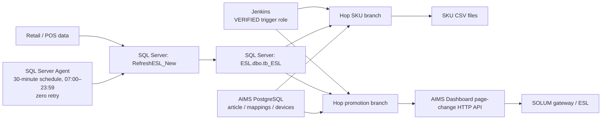
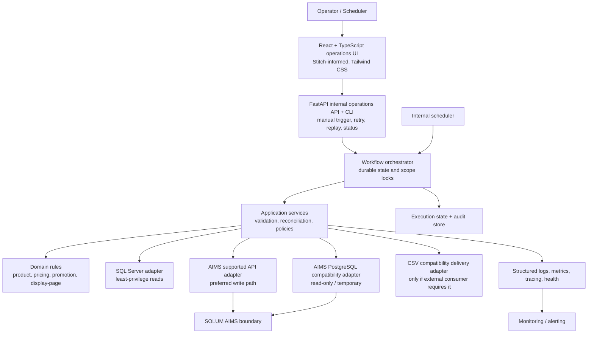

# System Architecture — SOLUM ESL / AIMS Pipeline Replacement

## 1. Architecture status and evidence

This document defines the approved target shape and records current-state evidence. It does not authorize application implementation. AIMS remains an external vendor boundary; its database layout is not a stable target contract.

## 2. Current architecture



### Verified dependency map

```text
Jenkins (job names/schedules UNKNOWN)
  ├─ esl-master-sku-updater.hpl
  │    └─ esl-sku-update-daily-new.hwf
  │         ├─ database connection check
  │         ├─ esl-compare-diff.hpl
  │         └─ esl-sku-update-to-csv.hpl
  └─ esl-master-promo-runner.hpl
       └─ esl-promo-sub-workflow-delay.hwf
            ├─ esl-sku-revert-to-normal-oos.hpl
            ├─ esl-sku-revert-to-normal-price.hpl
            └─ esl-sku-promo-multi-page.hpl
```

### Current-state inventory

| Artifact | Location | Type / purpose | Inputs / outputs | Trigger / failure handling | Class | Replacement area |
| --- | --- | --- | --- | --- | --- | --- |
| `RefreshESL_New` | `docs/sql-server/Store_Procedure_Refresh_ESL.sql` | Stored procedure builds ESL record state. | Retail tables → `tb_ESL`. | Called by `Refresh ESL Data`; SQL transaction/catch verified. | VERIFIED | Ingestion, rules, persistence orchestration. |
| `Refresh ESL Data` | `docs/sql-server/job_refresh_esl.sql` | SQL Agent job executes the stored procedure. | `EXEC dbo.RefreshESL_New`. | Every 30 min, 07:00–23:59 daily; zero retries; step fails job. | VERIFIED | Scheduler/retry replacement. |
| `tb_ESL` DDL | `docs/sql-server/tb_ESL_DDL.sql` | Legacy ESL data store. | Product/price/stock/promo record. | Existing table/indexes. | VERIFIED | SQL read model/source compatibility. |
| Discount troubleshooting report | `docs/sql-server/...Discount_Mismatch...md` | Business-rule evidence and risks. | Case study. | N/A. | VERIFIED | Rule-discovery baseline. |
| `esl-master-sku-updater.hpl` | Hop backup | SKU master entry pipeline. | `tb_ESL` stores → workflow. | Jenkins asserted by runbook. | VERIFIED / INFERRED trigger | Scheduling/orchestration. |
| `esl-sku-update-daily-new.hwf` | Hop backup | SKU DB check, diff, export. | SQL/AIMS reads → CSV. | Abort on child/check failure. | VERIFIED | SKU workflow. |
| `esl-compare-diff.hpl` | Hop backup | Compares source and AIMS article fields. | `tb_ESL`, AIMS `article` → changed item list. | No retry found. | VERIFIED | Diff/reconciliation rule. |
| `esl-sku-update-to-csv.hpl` | Hop backup | Exports new/changed SKU CSV. | Diff list + SQL → file. | Consumer unknown. | VERIFIED | SKU delivery adapter. |
| `esl-master-promo-runner.hpl` | Hop backup | Promotion entry; supplied SQL limits store `084`. | `tb_ESL` → workflow. | Jenkins asserted by runbook. | VERIFIED / INFERRED trigger | Scheduling/orchestration. |
| `esl-promo-sub-workflow-delay.hwf` | Hop backup | Ordered page workflow. | Store parameter → three pipelines. | Abort hops after final two steps. | VERIFIED | Page workflow. |
| OOS/normal reversion pipelines | Hop backup | Send recovered labels to Page 1. | SQL + AIMS mappings/pages → API, log CSV. | REST active. | VERIFIED | Display decision + AIMS write adapter. |
| promo multi-page pipeline | Latest `backup-pipeline` Hop artifact | Page 2 fixed, Page 3 percent, Page 4 OOS. | SQL + AIMS mappings/pages → API, files. | Page 3 REST is enabled and uses `STORE_CODE_PARAM`. Older `backup pipeline` snapshot differs. | VERIFIED | Display decision + AIMS write adapter. |
| RDBMS metadata/config | Hop backup metadata | Connection settings/reference. | SQL Server, AIMS Portal/Core. | Secrets intentionally omitted. | VERIFIED | Configuration/secrets migration. |
| AIMS DDL/config | Hop/Jenkins evidence | Schema/config reference. | Vendor context. | Contract support unknown. | VERIFIED | Compatibility discovery only. |
| AIMS Dashboard diagnostic + OpenAPI | `docs/hop-jenkins-pipeline/AIMS-Dashboard-Diagnostic-*`; deployed `/doc/json/common` | Read-only API discovery and documented page-change contract. | Article GET and Page-change API schema. | OpenAPI exposes `POST /common/labels/page`; vendor support lifecycle/auth policy still needs confirmation. | VERIFIED / NEEDS-DISCOVERY | AIMS API adapter. |

### Known gaps

Jenkins job configuration/schedules/command lines, runtime identity, production history, CSV consumer/acknowledgement contract, vendor support lifecycle/authentication policy, exact gateway topology, retention, and workload baseline are **UNKNOWN / NEEDS-DISCOVERY**.

## 3. Business and data flow

The desired business flow, subject to rule confirmation, is:

```text
Retail price/SKU/stock/promotion change
  → determine eligible ESL change
  → validate and apply approved business rules
  → determine required AIMS action
  → submit through supported AIMS interface
  → record acknowledgement/outcome
  → reconcile and alert exceptions
```

The target technical data flow is:

```text
source snapshot/window → extraction → validation → canonical transformation
→ domain decision → idempotent AIMS/file action → acknowledgement
→ durable audit/reconciliation → metrics/logs/alerts
```

## 4. Target architecture



### Component responsibilities

| Component | Responsibility | Must not do |
| --- | --- | --- |
| Scheduler / operations interface | Timed/manual invocation, authorization, status, disable/enable. | Implement business rules or bypass locks. |
| Workflow orchestrator | State machine, dependency order, locks, checkpoints, retry scheduling. | Embed SQL/AIMS transport details. |
| Domain rules | Deterministic eligibility, mapping, page decision, canonical idempotency input. | Query databases or issue HTTP. |
| SQL Server adapter | Snapshot/query source data and map to domain records. | Own workflow state or rules. |
| AIMS supported-API adapter | Mutate/confirm AIMS through documented vendor interface. | Reach into AIMS database tables. |
| Compatibility adapter | Bounded read-only queries needed for cutover parity. | Write, become a general AIMS repository, or leak schema to domain. |
| CSV compatibility delivery adapter | Produce/acknowledge files only if an identified legacy consumer remains required. | Act as workflow state, comparison evidence, audit system, or treat directory presence as success. |
| Execution state/audit store | Durable run state, locks, attempts, canonical hashes/diffs, action ledger, configurations, and evidence. | Become a second retail/AIMS source of record or rely on local files for recovery. |
| Reconciliation service | Compare expected, processed, rejected, submitted, acknowledged, and unresolved records. | Retry external actions without orchestration policy. |
| Observability/configuration | Correlated telemetry, health, validated external configuration/secrets references. | Store plaintext secrets in logs or repository. |

## 5. Deployment architecture

Initial deployment is one modular **Python + PostgreSQL web application** (or active/passive only if availability discovery requires it) on supported Windows/on-premise infrastructure. Its internal browser UI is a React + TypeScript application built with Vite and Tailwind CSS; the Python backend is FastAPI. The UI uses authenticated FastAPI endpoints only and never connects directly to SQL Server, PostgreSQL, or AIMS. Google Stitch is the design/handoff source: approved exports and screenshots guide the React implementation, but are not deployed without code review, type checks, automated tests, and API-contract integration. The same application supports command-line execution for development, diagnostics, and controlled administration. For continuous production operation it can run under Windows Service Control Manager using a dedicated Windows Service account, so authorized administrators can start, stop, pause, and resume it. Pause must quiesce scheduling and allow in-flight work to checkpoint or reach a documented safe state rather than abruptly killing it. PostgreSQL is the durable execution-state, audit, reconciliation, and queryable structured event-log store. The service replaces Jenkins and Hop as runtime scheduler/orchestrator.

The service must have isolated **development**, **staging**, and **production** environments. Each environment has separately managed configuration, credentials, database/schema or equivalent isolation, AIMS integration controls, and monitoring labels. Production promotion requires a versioned staging deployment, automated/integration evidence, an approved migration/release record, and a rollback-tested artifact. Staging must not drive physical production ESL effects.

### Hosting, secrets, deployment, and firewall baseline

- **Host:** use the available high-spec Windows 10 PC for production under explicit operational risk acceptance. Keep Windows Server or an organization-approved server platform as a future improvement, not a cutover blocker. Require current security patches, automatic restart/recovery configuration, sufficient disk/CPU/RAM capacity, backup, and documented recovery testing.
- **Service identity:** one non-administrator Windows service account per environment; deny interactive logon unless operations specifically requires it.
- **Secrets:** initially use a machine-scoped Windows DPAPI-protected secret bundle stored outside the repository under `%ProgramData%`, protected by NTFS ACLs to the service identity and designated administrators. Provision and rotate it through an approved administrator runbook. Do not place secret values in GitHub Actions, repository files, or logs. Replace this implementation with an organization-managed secret platform when one becomes available.
- **Build/release:** GitHub Actions builds, tests, scans, and produces a versioned immutable artifact. GitHub Environments provide dev/staging/production approval gates. Until the production host receives approved GitHub network access, it receives the signed/hashed artifact through the organization's controlled transfer method and a local administrator runs the deployment procedure. If GitHub access is enabled later, require a security review and allowlist only required HTTPS destinations; the host must never retrieve production secrets from GitHub.
- **Network:** deny public inbound access. Allow only approved administrator/deployment access from the management network. The service needs private, allowlisted routes to configured SQL Server, AIMS API, and its PostgreSQL state store; it does not require Internet access. Restrict the currently HTTP AIMS API to an allowlisted internal route; require TLS/reverse-proxy or vendor-supported secure transport if available before production acceptance. Browser-only human access is not a usable network contract for the background service.

Within a run, adapters return canonical records that are transformed and compared in memory. The service persists the source scope, canonical hashes/differences, checkpoints, and delivery/action ledger in its own durable state/audit database. This provides deterministic comparison, queryable evidence, restart recovery, and idempotency without relying on physical CSV files. A CSV remains only an outbound compatibility adapter until its consumer contract is replaced or decommissioned.

Containers, Kubernetes, message brokers, and distributed workflow platforms are deliberately not selected: current evidence does not demonstrate a scale or availability requirement that justifies their operational cost. Scaling starts with measured, bounded workers and per-store scope locks.

## 6. Technology evaluation and decision gates

No implementation language is locked before operations, skills, deployment policy, support model, and AIMS contract discovery. The default candidate is Python 3.12+ because it can provide SQL Server/API clients, testable modular services, scheduling, and Windows support with low deployment complexity. C# is a strong alternative if the organization’s Windows service, identity, operations, or team-support standards make it materially lower risk. Java/Go require a demonstrated operational or integration advantage.

Before implementation, score candidates against SQL Server drivers, Windows service management, secret/identity integration, AIMS API support, testing, observability, deployment, team competency, maintenance, and performance baseline. Record the result as an ADR. No microservice split is permitted without measured justification.

## 7. Failure architecture

| Dependency / failure | Detection | Retry / recovery | Data-consistency rule | Operator action |
| --- | --- | --- | --- | --- |
| SQL Server unavailable/timeout | Dependency health + adapter error. | Retryable within policy; retain window/checkpoint. | No AIMS action from incomplete/invalid source snapshot. | Restore dependency; retry/replay approved window. |
| AIMS/API unavailable/network interruption | Timeout, response classification, health. | Retryable only with idempotency key. | Persist ambiguous submission; reconcile before resend. | Escalate/vendor check if terminal. |
| AIMS rejection/unexpected response | Contract validation/error code. | Usually non-retryable until corrected. | Preserve payload/result; do not substitute direct DB write. | Quarantine/review. |
| Compatibility DB unavailable/schema drift | Query/schema validation. | Retry only availability errors. | No mutation depends solely on unverified read. | Disable adapter/use approved fallback; investigate vendor contract. |
| Malformed source/configuration | Validation/startup check. | Non-retryable until corrected. | Quarantine; no side effect. | Correct approved config/data. |
| Process crash/server reboot | Startup recovery scans active leases/checkpoints. | Resume or reconcile. | Never assume unknown external submission failed. | Review recovery report. |
| Disk exhaustion / logging outage | Host/telemetry health. | Stop new work safely when durability/audit cannot be ensured. | Preserve state before action. | Restore capacity. |
| Expired/rotated credential | Authentication health. | Retry after approved rotation only. | No fallback to embedded credentials. | Rotate secret and validate. |

## 8. Security architecture

Trust boundaries are SQL Server, AIMS API, optional read-only AIMS PostgreSQL, filesystem consumer, secrets platform, and monitoring platform. Each receives a separate identity and least privilege. The compatibility identity may SELECT only the explicitly approved views/tables and must lack write/DDL privileges. Target AIMS mutations require approved API authentication, TLS where supported, request/response audit, and allowlisted network routes. Credentials, encrypted blobs, and host-specific production configuration are never copied into documentation or source control.

## 9. Architectural decisions

| ID | Decision | Status / rationale |
| --- | --- | --- |
| AD-001 | Use a modular single service with durable state. | Approved; replaces runtime components without premature distributed complexity. |
| AD-002 | Keep domain rules separate from adapters and orchestration. | Approved; enables traceable testable rule extraction. |
| AD-003 | Treat AIMS as an external vendor boundary; prohibit direct AIMS DB writes. | Approved; avoids undocumented schema coupling. |
| AD-004 | Allow a temporary read-only AIMS PostgreSQL compatibility adapter for first cutover. | Approved by stakeholder; retire/replace after vendor API investigation. |
| AD-005 | Use shadow-first migration and preserve legacy fallback. | Approved; avoids big-bang cutover. |
| AD-006 | Do not create repository-local skills yet. | Verified compatible repository-local convention was not established from official documentation; no justified repeatable workflow exists in this phase. |
| AD-007 | Process canonical records in memory and persist comparison/delivery state in the target state/audit database. | Approved; CSV files are not a target state or parity mechanism and remain only as temporary compatibility delivery if required. |
| AD-008 | Use Python + PostgreSQL as an internal web application with browser UI/API, CLI, and optional Windows Service hosting. | Stakeholder clarified that the system is web based and may run as a Windows Service or by command line; PostgreSQL owns target state/audit/log queries, not retail/AIMS source data. |
| AD-009 | Use Windows DPAPI-protected per-environment secret bundles and GitHub Actions artifact promotion with controlled local deployment. | Chosen for the currently known Windows/GitHub and potentially Internet-isolated production environment; production does not need GitHub connectivity. |
| AD-010 | Accept the high-spec Windows 10 PC as the production host under operational risk acceptance; deny public ingress and use least-privilege private network routes. | This removes the unavailable Windows Server dependency while recording the operational controls and future-platform improvement path. |
| AD-011 | Use FastAPI for the internal backend/API and React + TypeScript + Vite + Tailwind CSS for the browser UI; use Google Stitch as a versioned design handoff. | The stack supports typed API contracts, controlled Windows deployment, and systematic conversion of Stitch exports into maintainable, tested components. |
