# Apache Hop \+ SOLUM ESL Current Integration Architecture and Runbook

**Document type:** Technical architecture \+ ETL/workflow runbook

**Scope:** Jenkins, Apache Hop, Microsoft SQL Server, AIMS PostgreSQL, AIMS Dashboard service, Newton Gateway, ESL devices

**Primary environment:** On\-premise ESL integration environment

**Document status:** Working documentation derived from the supplied Apache Hop artifacts and the architecture sketch

---

## 1\. Purpose

This document describes the current Electronic Shelf Label (ESL) integration solution built around **Jenkins**, **Apache Hop**, **Microsoft SQL Server**, the **SOLUM AIMS platform**, and **Newton Gateways**\.

The primary goals are to:

1. document the end\-to\-end architecture;

2. explain the purpose of each Apache Hop pipeline (`.hpl`) and workflow (`.hwf`);

3. document the runtime sequence and parent/child dependency hierarchy;

4. explain how SKU data is compared and exported;

5. explain how ESL display pages are changed for normal price, promotion, and out\-of\-stock conditions;

6. document variables, database dependencies, REST endpoints, and filesystem outputs;

7. identify implementation assumptions, operational risks, and areas that require confirmation or improvement\.

This document is intended to serve as a baseline for troubleshooting, future changes, onboarding, and subsequent architecture discussions\.

---

## 2\. Source Artifacts Reviewed

The following Apache Hop files were reviewed:

| **File**                             | **Type** | **Role**                                                          |
| ------------------------------------ | -------- | ----------------------------------------------------------------- |
| `esl-master-sku-updater.hpl`         | Pipeline | Jenkins entry point for SKU synchronization                       |
| `esl-sku-update-daily-new.hwf`       | Workflow | Orchestrates SKU comparison and CSV creation                      |
| `esl-compare-diff.hpl`               | Pipeline | Compares SQL Server product data against AIMS Portal article data |
| `esl-sku-update-to-csv.hpl`          | Pipeline | Exports new/changed SKU data to CSV                               |
| `esl-master-promo-runner.hpl`        | Pipeline | Jenkins entry point for promotion/display\-page management        |
| `esl-promo-sub-workflow-delay.hwf`   | Workflow | Orchestrates page reversion and promotion/OOS page changes        |
| `esl-sku-revert-to-normal-oos.hpl`   | Pipeline | Returns recovered OOS labels from Page 4 to Page 1                |
| `esl-sku-revert-to-normal-price.hpl` | Pipeline | Return non\-promotional labels to Page 1                          |
| `esl-sku-promo-multi-page.hpl`       | Pipeline | Applies Page 2 / Page 3 / Page 4 display logic                    |

An additional uploaded copy, `esl-master-promo-runner(1).hpl`, is byte\-identical to `esl-master-promo-runner.hpl` and is therefore treated as a duplicate rather than a separate component\.

### User\-provided orchestration context

Jenkins runs two top\-level pipelines:

- `esl-master-promo-runner.hpl`

- `esl-master-sku-updater.hpl`

Their direct child workflows are:

- `esl-master-promo-runner.hpl` → `esl-promo-sub-workflow-delay.hwf`

- `esl-master-sku-updater.hpl` → `esl-sku-update-daily-new.hwf`

---

## 3\. System Context

The supplied architecture sketch and Apache Hop definitions indicate the following principal systems\.

| **Component**                                  | **Technology**          | **Known address / location**                                                               | **Function**                                                                                                                     |
| ---------------------------------------------- | ----------------------- | ------------------------------------------------------------------------------------------ | -------------------------------------------------------------------------------------------------------------------------------- |
| Enterprise Data Warehouse / ESL product source | Microsoft SQL Server    | `192.168.85.55` <br>                                                                       | Source of ESL product, stock, pricing and promotion information                                                                  |
| ESL integration server                         | Windows / on\-premise   | `192.168.85.213`                                                                           | Hosts Jenkins, Apache Hop, AIMS\-related services and integration artifacts                                                      |
| Jenkins                                        | Jenkins                 | ESL integration server                                                                     | Scheduling and execution trigger for the two master Hop pipelines                                                                |
| Apache Hop                                     | Apache Hop              | ESL integration server                                                                     | ETL, comparison, orchestration and REST\-call logic                                                                              |
| AIMS Portal database                           | PostgreSQL              | Connection alias `DB AIMS PORTAL (ESL ID - Product ID)`\. IP Address `192.168.85.213:9010` | AIMS product/article, label mapping and device page\-state data                                                                  |
| AIMS Core database                             | PostgreSQL              | Connection alias `DB AIMS CORE (Template Page Type)`\. IP Address `192.168.85.213:9010`    | Referenced by the SKU workflow's DB connection health check                                                                      |
| AIMS Dashboard service                         | HTTP service            | `192.168.85.213:9001`                                                                      | Receives label page\-change requests                                                                                             |
| Gateway Launcher                               | SOLUM utility / service | ESL integration environment                                                                | Gateway configuration/management component; exact downstream runtime role should be validated against the installed AIMS version |
| Newton Gateway                                 | SOLUM hardware          | Stores / ESL radio domain                                                                  | Bridges AIMS\-side control to physical ESL devices over RF                                                                       |
| ESL devices                                    | E\-paper labels         | Store shelf edge                                                                           | Displays normal price, promotion and OOS pages                                                                                   |

---

# 4\. Architecture Diagrams

## 4\.1 Structured architecture view

This retains the preferred “diagram 3” style while incorporating details proven by the Hop files\.

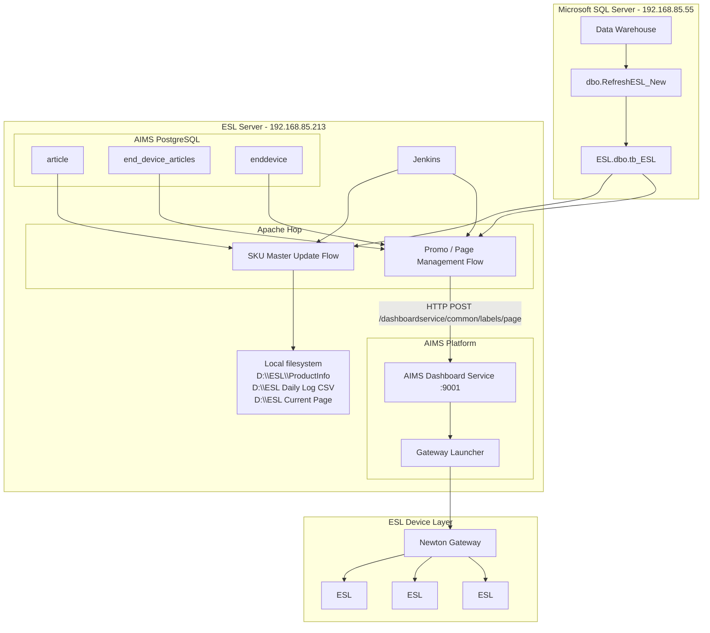

> **Important architecture note:** The Hop files directly prove the call from Apache Hop to the AIMS Dashboard service at `192.168.85.213:9001`\. The exact internal runtime relationship `AIMS Dashboard → Gateway Launcher → Newton Gateway` is based on the current architecture sketch and should be validated against the installed SOLUM/AIMS release\. The Gateway Launcher is commonly a provisioning/configuration utility rather than a mandatory inline data\-plane component\.

---

## 4\.2 Runtime sequence view

This retains the preferred “diagram 4” sequence\-oriented view\.

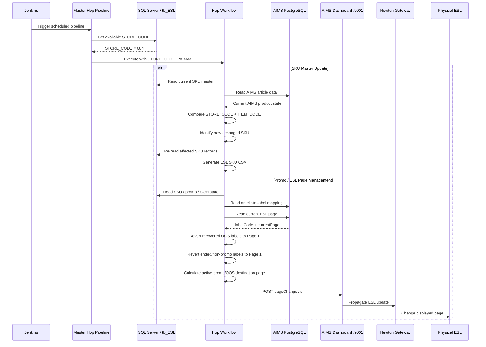

---

# 5\. Apache Hop Dependency Tree

The complete logical dependency tree is:

```Plain Text
Jenkins
│
├── esl-master-sku-updater.hpl
│   │
│   └── esl-sku-update-daily-new.hwf
│       │
│       ├── Check DB Connection
│       ├── esl-compare-diff.hpl
│       └── esl-sku-update-to-csv.hpl
│
└── esl-master-promo-runner.hpl
    │
    └── esl-promo-sub-workflow-delay.hwf
        │
        ├── esl-sku-revert-to-normal-oos.hpl
        ├── esl-sku-revert-to-normal-price.hpl
        └── esl-sku-promo-multi-page.hpl
```

The solution therefore has two main functional branches:

1. **SKU Master Synchronization** – detects product\-level differences and writes a CSV payload\.

2. **Promotion / Page Management** – calculates and submits physical ESL page changes through the AIMS Dashboard REST service\.

---

# 6\. Jenkins Entry Points

## 6\.1 SKU updater entry point

Jenkins executes:

```Plain Text
esl-master-sku-updater.hpl
```

The pipeline reads available stores from SQL Server and invokes the child workflow once per input row/group\.

Current SQL:

```SQL
SELECT DISTINCT STORE_CODE
FROM [ESL].[dbo].[tb_ESL]
WHERE STORE_CODE = '084';
```

### Current implication

The pipeline is structurally capable of processing multiple stores, but SQL currently restricts processing to **store \*\***`084`\*\*\.

The Workflow Executor maps:

```Plain Text
Input field: STORE_CODE
       ↓
Workflow variable: STORE_CODE_PARAM
```

Key executor configuration:

| **Setting**        | **Value**                                      |
| ------------------ | ---------------------------------------------- |
| Child workflow     | `${PROJECT_HOME}/esl-sku-update-daily-new.hwf` |
| `group_size`       | `1`                                            |
| `inherit_all_vars` | `Y`                                            |
| `distribute`       | `Y`                                            |
| Run configuration  | `local`                                        |
| Copies             | `1`                                            |

> A future multi\-store version could remove the hardcoded `WHERE STORE_CODE = '084'`, allowing one workflow invocation per returned store\.

---

## 6\.2 Promotion runner entry point

Jenkins executes:

```Plain Text
esl-master-promo-runner.hpl
```

Current SQL:

```SQL
SELECT DISTINCT store_code
FROM esl.dbo.tb_esl
WHERE store_code = '084';
```

The child mapping is:

```Plain Text
Input field: store_code
       ↓
Workflow variable: STORE_CODE_PARAM
```

Key executor configuration:

| **Setting**        | **Value**                                          |
| ------------------ | -------------------------------------------------- |
| Child workflow     | `${PROJECT_HOME}/esl-promo-sub-workflow-delay.hwf` |
| `group_size`       | `1`                                                |
| `inherit_all_vars` | `Y`                                                |
| `distribute`       | `Y`                                                |
| Run configuration  | `local`                                            |
| Copies             | `1`                                                |

This pipeline is also currently constrained to **store \*\***`084`\*\*\.

---

# 7\. Branch A — SKU Master Synchronization

## 7\.1 Workflow overview

The SKU branch is:

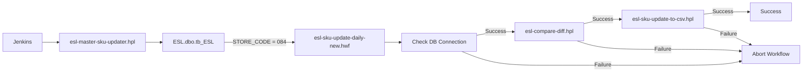

---

## 7\.2 `esl-sku-update-daily-new.hwf`

### Purpose

Coordinates the SKU\-difference detection and CSV export process\.

### Control flow

```Plain Text
Start
  ↓
Check DB Connection
  ├─ failure → Abort Workflow
  └─ success
       ↓
esl-compare-diff.hpl
  ├─ failure → Abort Workflow
  └─ success
       ↓
esl-sku-update-to-csv.hpl
  ├─ failure → Abort Workflow
  └─ success → Success
```

### Database connection pre\-check

The workflow validates the following Hop database connections before processing:

1. `DB AIMS PORTAL (ESL ID - Product ID)`

2. `DB ESL Product`

3. `DB AIMS CORE (Template Page Type)`

The workflow therefore has an explicit fail\-fast mechanism for unavailable databases\.

### Child execution behavior

Both child pipelines run with:

- `wait_until_finished = Y`

- `parallel = N`

- `run_configuration = local`

- `pass_all_parameters = Y`

This means processing is **synchronous and sequential**\.

---

# 8\. `esl-compare-diff.hpl`

## 8\.1 Purpose

This pipeline compares the current enterprise product state in SQL Server against product/article data currently held by AIMS Portal\.

Its main output is a root\-workflow variable named:

```Plain Text
LIST_ITEM_CODE_DIFF
```

containing a comma\-separated SQL\-ready list of item codes identified as **new** or **changed**\.

---

## 8\.2 Source A — SQL Server product data

Connection:

```Plain Text
DB ESL Product
```

Source table:

```Plain Text
[ESL].[dbo].[tb_ESL]
```

Store condition:

```SQL
WHERE STORE_CODE = '${STORE_CODE_PARAM}'
```

The query projects a broad set of product, stock, promotion, taxonomy and metadata attributes, including:

- `STORE_CODE`

- `ITEM_CODE`

- `BARCODE`

- `ITEM_NAME`

- `ITEM_SHORTNAME`

- `SALES_PRICE`

- `DISC_PRICE`

- `DISC_PERCENT`

- `DISC_TEXT`

- `MEMBER_PRICE`

- `SOH`

- `EARLY_EXPIRY_DATE`

- `PROD_WEIGHT`

- `MIN_QTY`

- `MAX_QTY`

- `PRODUCT_URL`

- `DIVISION`

- `DEPARTMENT`

- `CLASS`

- `SUBCLASS`

- `BRAND`

- `CLASS_ROTATION`

- `NFC_URL`

- `CONSIGMENT`

- `RETURNABLE`

- `EXPIRY_DAYS`

- `DISPLAY_QTY`

- `LAST_UPDATED_DATE`

- `SYNC_REC`

- `UOM`

- `PROMO_FLAG`

- `PER_GRM_PROMO_PRICE`

- `PER_GRM_SELL_PRICE`

- `PROMOTION_TYPE`

- `CAMPAIGN_GROUP`

- `REDLIST`

- `SAVE_AMT`

- `CREATED_DATE`

- `PROMO_START_DATE`

- `PROMO_END_DATE`

- `PROMO_START_TIME`

- `PROMO_END_TIME`

Date/time fields are normalized in the SQL expression before comparison/export\.

---

## 8\.3 Source B — AIMS Portal article data

Connection:

```Plain Text
DB AIMS PORTAL (ESL ID - Product ID)
```

Query:

```SQL
SELECT *
FROM article
WHERE station_code = '${STORE_CODE_PARAM}'
ORDER BY article_id ASC;
```

The pipeline reads the AIMS `article` table and expands article payload information through a JSON Input transform\.

Conceptually:

```Plain Text
article
├── article_id
├── station_code
├── created / modified metadata
└── data (JSON)
    ├── ITEM_CODE
    ├── BARCODE
    ├── SALES_PRICE
    ├── DISC_PRICE
    ├── SOH
    ├── PROMO_FLAG
    └── other product fields
```

---

## 8\.4 Difference detection

The central transform is:

```Plain Text
Merge rows (diff)
```

### Merge keys

```Plain Text
STORE_CODE
ITEM_CODE
```

### Reference vs comparison streams

- Reference stream: `Select values data AIMS`

- Compare stream: `Table input DB Product Internal`

The result field is:

```Plain Text
diff_status
```

### Fields actually used for value comparison

Only the following fields are configured in the Merge Rows value list:

1. `ITEM_CODE`

2. `BARCODE`

3. `SALES_PRICE`

4. `DISC_PRICE`

5. `SOH`

6. `PROMO_FLAG`

7. `REDLIST`

8. `PROMO_START_DATE`

9. `PROMO_END_DATE`

10. `PROMO_START_TIME`

11. `PROMO_END_TIME`

This is an important implementation detail: although many product columns are selected and later exported, **not all of them participate in change detection**\.

For example, a change to `ITEM_NAME` or `MEMBER_PRICE` alone may not create a `changed` status if no configured comparison field changes\.

---

## 8\.5 Difference states

The Switch/Case transform handles:

| **`diff_status`** | **Action**                        |
| ----------------- | --------------------------------- |
| `identical`       | Routed to dummy/no\-op branch     |
| `changed`         | Routed to changed/new processing  |
| `deleted`         | Routed to dummy/no\-op branch     |
| `new`             | Routed to changed/new processing  |
| other/default     | Routed to identical/no\-op branch |

Therefore, downstream SKU export is driven only by:

```Plain Text
changed
new
```

AIMS\-side rows that appear `deleted` are currently **not processed as deletion events**\.

---

## 8\.6 Building the SQL item\-code list

For each changed/new row, a JavaScript transform creates:

```JavaScript
sql_item_code = "'" + ITEM_CODE + "'";
```

For example:

```Plain Text
100001
100002
100003
```

becomes:

```Plain Text
'100001','100002','100003'
```

A `Memory group by` transform uses `CONCAT_COMMA` to concatenate the values\.

The resulting field:

```Plain Text
sql_item_code-concat
```

is assigned by `Set variables` to:

```Plain Text
LIST_ITEM_CODE_DIFF
```

with variable scope:

```Plain Text
ROOT_WORKFLOW
```

This allows the next pipeline in the parent workflow to consume the difference list\.

---

## 8\.7 Empty\-difference protection

The pipeline includes a `Detect empty stream` branch\.

If there are no changed/new products, JavaScript creates:

```Plain Text
'__NO_DATA__'
```

This value is passed through the same aggregation path and becomes the effective `LIST_ITEM_CODE_DIFF` value\.

This avoids generating invalid SQL such as:

```SQL
ITEM_CODE IN ()
```

and instead generates a safe no\-match predicate similar to:

```SQL
ITEM_CODE IN ('__NO_DATA__')
```

---

# 9\. `esl-sku-update-to-csv.hpl`

## 9\.1 Purpose

Re\-queries SQL Server for only the item codes identified by `esl-compare-diff.hpl` and generates the product CSV consumed by the next stage of the ESL ecosystem\.

---

## 9\.2 Input variables

The pipeline depends on:

```Plain Text
STORE_CODE_PARAM
LIST_ITEM_CODE_DIFF
```

The SQL predicate is conceptually:

```SQL
WHERE STORE_CODE = '${STORE_CODE_PARAM}'
  AND ITEM_CODE IN (${LIST_ITEM_CODE_DIFF})
ORDER BY ITEM_CODE ASC;
```

---

## 9\.3 Data cleansing

The SQL query explicitly replaces commas in product names to protect the comma\-delimited output structure, for example:

```SQL
REPLACE(CAST([ITEM_NAME] AS CHAR), ',', '.') AS [ITEM_NAME]
```

and similarly for `ITEM_SHORTNAME`\.

This compensates for the output configuration using a comma separator with no enclosure configured\.

---

## 9\.4 Output file

Output transform:

```Plain Text
Updated SKU ESL CSV
```

Base path:

```Plain Text
D:\ESL\ProductInfo\ESL_SKU_${STORE_CODE_PARAM}
```

Configuration:

| **Property**            | **Value** |
| ----------------------- | --------- |
| Extension               | `.csv`    |
| Delimiter               | comma     |
| Header                  | `N`       |
| DOS format              | `Y`       |
| Append                  | `N`       |
| Add date                | `Y`       |
| Add time                | `Y`       |
| Fast dump               | `Y`       |
| Add to result filenames | `Y`       |

For store `084`, the generated file name begins with:

```Plain Text
D:\ESL\ProductInfo\ESL_SKU_084...
```

The precise timestamp suffix is generated by Hop's Text File Output configuration\.

---

# 10\. Branch B — Promotion and ESL Page Management

## 10\.1 Workflow overview

The promotion branch is:

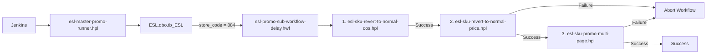

The execution order is intentional:

1. recover labels from OOS state;

2. recover labels from expired/non\-promo promotional state;

3. apply the currently valid promotion/OOS state\.

---

# 11\. `esl-promo-sub-workflow-delay.hwf`

## 11\.1 Purpose

Orchestrates the three display\-page management pipelines for a store\.

### Execution order

```Plain Text
Start
  ↓
esl-sku-revert-to-normal-oos.hpl
  ↓
esl-sku-revert-to-normal-price.hpl
  ↓
esl-sku-promo-multi-page.hpl
  ↓
Success
```

The last two pipeline actions have explicit failure hops to `Abort workflow`\.

Each child pipeline has:

- `wait_until_finished = Y`

- `parallel = N`

- `run_configuration = local`

- `STORE_CODE_PARAM = ${STORE_CODE_PARAM}`

- `pass_all_parameters = Y`

The workflow therefore processes the store **sequentially**\.

---

# 12\. ESL Page Model

The pipeline definitions reveal the following display\-page convention:

| **Page** | **Intended meaning**     | **Evidence in pipeline**                           |
| -------- | ------------------------ | -------------------------------------------------- |
| **1**    | Normal / standard price  | Reversion pipelines set destination page to 1      |
| **2**    | Fixed\-price promotion   | `Add constants FIXED PRICE` / Page 2 REST branch   |
| **3**    | Percent\-based promotion | `Add constants PERCENT BASED` / Page 3 branch      |
| **4**    | Out of stock             | `Add constants OUT OF STOCK (PAGE 4)` / OOS branch |

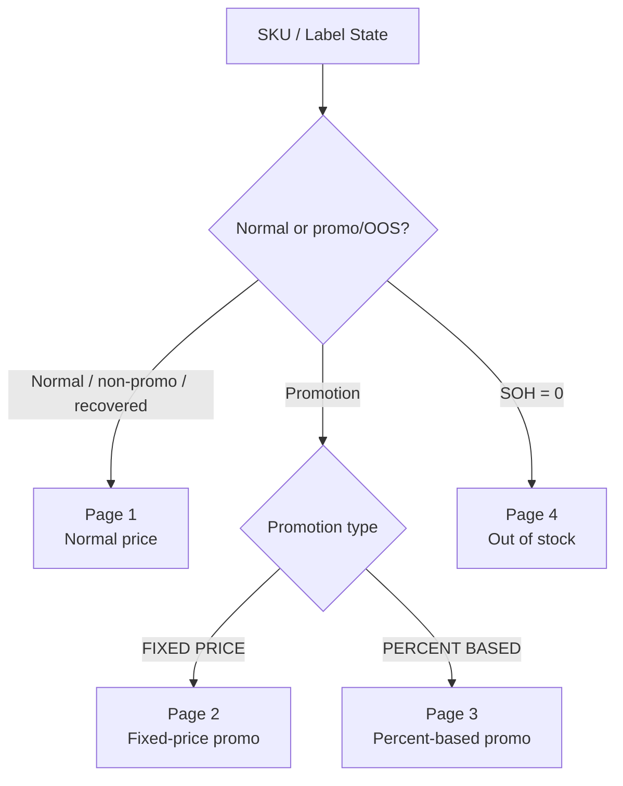

---

# 13\. `esl-sku-revert-to-normal-oos.hpl`

## 13\.1 Purpose

Returns labels currently showing the OOS display back to Page 1 when the associated SKU has stock again\.

The intended business rule is:

```Plain Text
Current ESL page = 4
AND
SQL Server SOH > 0
        ↓
Destination page = 1
```

---

## 13\.2 Product source

SQL Server query:

```SQL
SELECT *
FROM dbo.tb_esl
WHERE store_code = '${STORE_CODE_PARAM}'
  AND SOH > 0
ORDER BY item_code ASC;
```

---

## 13\.3 AIMS label mapping

AIMS Portal query:

```SQL
SELECT *
FROM end_device_articles
WHERE station_code = '${STORE_CODE_PARAM}'
ORDER BY article_id ASC;
```

This table provides the relationship between an AIMS article/product and physical label code\.

---

## 13\.4 Current ESL page source

AIMS Portal query:

```SQL
SELECT station_code, label_code, pages
FROM enddevice a
JOIN end_device_articles b
  ON a.code = b.label_code
WHERE station_code = '${STORE_CODE_PARAM}'
  AND a.state = 'SUCCESS'
ORDER BY article_id ASC;
```

The `pages` field is parsed as JSON to obtain current page state\.

---

## 13\.5 Processing logic

The pipeline:

1. reads SKUs with `SOH > 0`;

2. reads article\-to\-label mappings;

3. merge\-joins product and label mapping;

4. reads current label page metadata;

5. parses `pages` JSON;

6. filters for labels currently on Page 4;

7. merge\-joins these label states back to the recovered\-stock product set;

8. adds destination constants for Page 1;

9. creates a page\-change JSON payload;

10. calls the AIMS Dashboard REST service;

11. writes an audit CSV and workflow result rows\.

---

## 13\.6 REST endpoint

```Plain Text
POST http://192.168.85.213:9001/dashboardservice/common/labels/page?store='${STORE_CODE_PARAM}'
```

The generated request structure is based on a page\-change list, conceptually:

```JSON
{
  "pageChangeList": [
    {
      "page": 1,
      "labelCode": "<label-code>"
    }
  ]
}
```

---

## 13\.7 Audit output

Base output file:

```Plain Text
D:\ESL Daily Log CSV\REVERT-OOS_${STORE_CODE_PARAM}_PG1
```

Configuration:

- CSV extension

- header enabled

- date added

- time added

- file added to result filenames

The logical action is also tagged as a **revert\-OOS** operation in pipeline result fields\.

---

# 14\. `esl-sku-revert-to-normal-price.hpl`

## 14\.1 Purpose

Returns labels to Page 1 for SKUs that are no longer promotional, provided the SKU is not out of stock\.

Core business rule:

```Plain Text
PROMO_FLAG = 0
AND
SOH != 0
AND
currentPage != Page 1
        ↓
Destination page = 1
```

---

## 14\.2 Product source

```SQL
SELECT *
FROM dbo.tb_esl
WHERE store_code = '${STORE_CODE_PARAM}'
  AND promo_flag = 0
ORDER BY item_code ASC;
```

---

## 14\.3 AIMS label data

The pipeline reads the same two key AIMS Portal structures:

- `end_device_articles` for product\-to\-label relationships;

- `enddevice` joined to `end_device_articles` for current label pages\.

Only devices with:

```Plain Text
a.state = 'SUCCESS'
```

are included in the current\-page query\.

---

## 14\.4 Page\-change decision

After merge joins and constants are applied, the filter is named:

```Plain Text
Filter rows currentPage != existingPage && SOH != 0
```

The destination is Page 1\.

This prevents unnecessary requests for labels already on the correct page and avoids switching an out\-of\-stock SKU to a normal\-price page\.

---

## 14\.5 REST endpoint

```Plain Text
POST http://192.168.85.213:9001/dashboardservice/common/labels/page?store='${STORE_CODE_PARAM}'
```

---

## 14\.6 Audit output

```Plain Text
D:\ESL Daily Log CSV\REVERT-PROMO_${STORE_CODE_PARAM}_PG1
```

The file includes a header and date/time suffix\.

---

# 15\. `esl-sku-promo-multi-page.hpl`

## 15\.1 Purpose

Determines the correct promotion/OOS display page for active promotional SKUs and submits page changes to the AIMS Dashboard service\.

It handles three target pages:

- Page 2 – fixed\-price promotion;

- Page 3 – percentage\-based promotion;

- Page 4 – out of stock\.

---

## 15\.2 Active promotion source

SQL Server query:

```SQL
SELECT *
FROM dbo.tb_esl
WHERE CAST(GETDATE() AS DATE)
      BETWEEN CAST(NULLIF(promo_start_date, '') AS DATE)
          AND CAST(NULLIF(promo_end_date, '') AS DATE)
  AND store_code = '${STORE_CODE_PARAM}'
  AND promo_flag = 1
ORDER BY item_code ASC;
```

Therefore, a product enters the active\-promotion branch only when:

1. `PROMO_FLAG = 1`;

2. The current date is between `PROMO_START_DATE` and `PROMO_END_DATE`;

3. its store matches `STORE_CODE_PARAM`\.

---

## 15\.3 Product\-to\-label mapping

```SQL
SELECT *
FROM end_device_articles
WHERE station_code = '${STORE_CODE_PARAM}'
ORDER BY article_id ASC;
```

The pipeline merge\-joins the SQL Server SKU stream to this mapping to associate the business SKU with physical ESL `label_code` values\.

---

## 15\.4 Current page input

The pipeline reads:

```SQL
SELECT station_code, label_code, pages
FROM enddevice a
JOIN end_device_articles b
  ON a.code = b.label_code
WHERE station_code = '${STORE_CODE_PARAM}'
  AND --( a.state = 'SUCCESS'
      --OR a.state = 'TIMEOUT')
ORDER BY label_code ASC;
```

### Important observation

The `a.state` condition is commented out in this pipeline's SQL text\. This differs from the two reversion pipelines, which explicitly use `a.state = 'SUCCESS'`\.

That means the promotion multi\-page pipeline may process device page rows regardless of state, depending on the SQL parser behavior around the commented lines\.

This should be reviewed intentionally rather than treated as accidental\.

---

## 15\.5 Join path

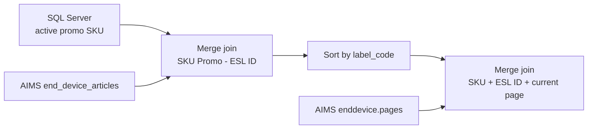

Sort transforms exist before the merge join because Hop merge joins require compatible ordering\.

---

# 16\. Promotion Page Decision Logic

## 16\.1 Page 2 — fixed\-price promotion

Pipeline branch:

```Plain Text
Filter rows FIXED PRICE
    ↓
Add constants FIXED PRICE
    ↓
Filter rows currentPage != destinationPage (PAGE 2)
    ↓
Enhanced JSON Output PAGE 2
    ↓
REST client PG 2
```

REST endpoint:

```Plain Text
http://192.168.85.213:9001/dashboardservice/common/labels/page?store='${STORE_CODE_PARAM}'
```

The `currentPage != destinationPage` check prevents repeated page\-change calls for labels already on Page 2\.

---

## 16\.2 Page 3 — percent\-based promotion

Pipeline branch:

```Plain Text
Add constants PERCENT BASED
    ↓
Filter rows currentPage != destinationPage (PAGE 3)
    ↓
Enhanced JSON Output PAGE 3
    ↓
REST client PG 3
```

However, the hop:

```Plain Text
Enhanced JSON Output PAGE 3 → REST client PG 3
```

is configured with:

```Plain Text
enabled = N
```

Therefore **Page 3 REST submission is currently disabled**\.

Additionally, the Page 3 REST URL uses a different variable name:

```Plain Text
${PARAM_STORE_CODE}
```

instead of the otherwise standard:

```Plain Text
${STORE_CODE_PARAM}
```

This is a material configuration discrepancy and should be considered either:

- deliberately dormant/incomplete Page 3 functionality; or

- a defect waiting to surface if the disabled hop is re\-enabled\.

No change should be made until the intended Page 3 behavior is confirmed\.

---

## 16\.3 Page 4 — out of stock

The OOS branch is:

```Plain Text
Filter rows OUT OF STOCK
    ↓
Add constants OUT OF STOCK (PAGE 4)
    ↓
Filter rows currentPage != destinationPage (PAGE 4)
    ↓
Enhanced JSON Output PAGE 4
    ↓
REST client PG 4
```

REST endpoint:

```Plain Text
http://192.168.85.213:9001/dashboardservice/common/labels/page?store='${STORE_CODE_PARAM}'
```

The branch is driven by stock state, with Page 4 representing out\-of\-stock display behavior\.

---

# 17\. AIMS REST Integration

## 17\.1 Endpoint

All active page\-change requests target the local AIMS Dashboard service:

```Plain Text
192.168.85.213:9001
```

Path:

```Plain Text
/dashboardservice/common/labels/page
```

Store is passed as a URL query parameter\.

---

## 17\.2 Conceptual request flow

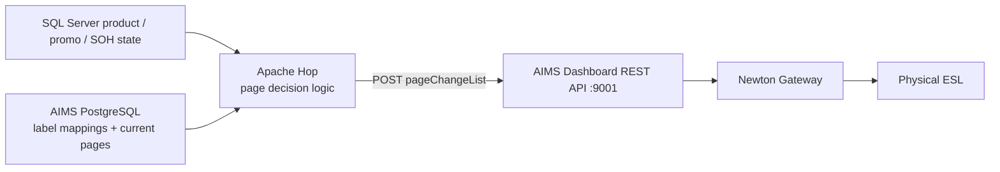

---

# 18\. AIMS PostgreSQL Data Used by Hop

Three AIMS\-side data structures are especially important\.

## 18\.1 `article`

Used by:

```Plain Text
esl-compare-diff.hpl
```

Role:

- represents AIMS\-side article/product state;

- includes `station_code` and `article_id`;

- includes a JSON payload used to reconstruct comparable SKU fields\.

This table is the reference side of the SQL\-vs\-AIMS product comparison\.

---

## 18\.2 `end_device_articles`

Used by:

- `esl-sku-revert-to-normal-oos.hpl`

- `esl-sku-revert-to-normal-price.hpl`

- `esl-sku-promo-multi-page.hpl`

Role:

```Plain Text
AIMS article/product ↔ physical ESL label_code
```

It is the key mapping between business product identity and device identity\.

---

## 18\.3 `enddevice`

Used by page\-management pipelines\. Relevant fields include:

- device `code` / label identity;

- `state`;

- `pages` JSON\.

The `pages` payload is parsed to derive page\-state information such as:

```Plain Text
currentPage
exceptionPage
returnPage
```

This allows Hop to avoid unnecessary page changes and to recognize devices requiring reversion\.

---

# 19\. Filesystem Outputs and Operational Logs

The Apache Hop workflows generate two confirmed categories of filesystem output on the ESL server:

1. Current\-state page snapshots

2. Historical daily execution logs

## 19\.1 ProductInfo

```Plain Text
D:\ESL\ProductInfo\
```

Primary output:

```Plain Text
ESL_SKU_${STORE_CODE_PARAM}*.csv
```

Purpose:

- new/changed SKU product\-data export;

- likely downstream input to an AIMS/Gateway\-related import mechanism, which should be explicitly confirmed in the next phase of documentation\.

---

## 19\.2 Daily Log CSV

```Plain Text
D:\ESL Daily Log CSV\
```

Known outputs:

```Plain Text
REVERT-OOS_${STORE_CODE_PARAM}_PG1*.csv
REVERT-PROMO_${STORE_CODE_PARAM}_PG1*.csv
PROMO_${STORE_CODE_PARAM}_PG2*.csv
OOS_${STORE_CODE_PARAM}_PG4*.csv
```

Purpose:

- operational audit trail;

- troubleshooting;

- evidence of which label/page actions the pipelines attempted or evaluated\.

---

## 19\.3 Current Page Snapshot Files

#### 19\.3\.1 Page 2 Current\-State Snapshot

```Plain Text
D:\ESL Current Page\
```

These files are generated by:

```Plain Text
esl-sku-promo-multi-page.hpl
```

Output path pattern:

```Plain Text
D:\ESL Current Page\CURRENT_${STORE_CODE_PARAM}_PG2.csv
```

Purpose:

- Stores the current set of ESLs associated with Page 2\.

- Page 2 represents the Fixed Price promotion display state\.

- Used as an operational snapshot rather than a historical log\.

Output behavior:

```Plain Text
append = N
add_date = N
add_time = N
```

Because the filename does not contain a timestamp and append mode is disabled, each execution overwrites or refreshes the current snapshot for the corresponding store\.

Flow diagram:

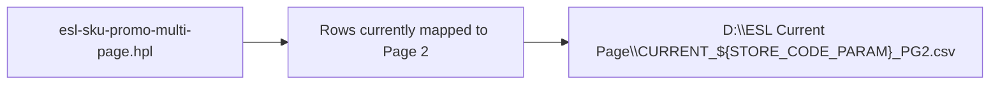

---

#### 19\.3\.2 Page 4 Current\-State Snapshot

Transform:

```Plain Text
Text file ALL PG4
```

Output path pattern:

```Plain Text
D:\ESL Current Page\CURRENT_${STORE_CODE_PARAM}_PG4.csv
```

Purpose:

- Stores the current set of ESLs associated with Page 4\.

- Page 4 represents the Out\-of\-Stock display state\.

- Used as an operational snapshot rather than a historical log\.

Output behavior:

```Plain Text
append = N
add_date = N
add_time = N
```

Flow diagram:


---

#### 19\.3\.3 Daily Historical Log Files

Directory:

```Plain Text
D:\ESL Daily Log CSV
```

This directory stores execution logs generated by three promotion\-related pipelines:

```Plain Text
esl-sku-promo-multi-page.hpl
esl-sku-revert-to-normal-oos.hpl
esl-sku-revert-to-normal-price.hpl
```

Unlike the Current Page files, these outputs use date/time suffixes and therefore behave as historical execution logs\.

---

#### 19\.3\.4 Promotion Page 2 Log

Pipeline:

```Plain Text
esl-sku-promo-multi-page.hpl
```

Transform:

```Plain Text
Text file output PG 2 PROMO
```

Output filename pattern:

```Plain Text
PROMO_${STORE_CODE_PARAM}_PG2_<date/time>.csv
```

Purpose:

- Records ESLs that are changed to Page 2\.

- Page 2 is used for Fixed Price promotion displays\.

- Represents an applied promotion action\.

Expected action value:

```Plain Text
PROMO
```

#### 19\.3\.5 Out\-of\-Stock Page 4 Log

Pipeline:

```Plain Text
esl-sku-promo-multi-page.hpl
```

Transform:

```Plain Text
Text file output PG 4 OOS
```

Output filename pattern:

```Plain Text
OOS_${STORE_CODE_PARAM}_PG4_<date/time>.csv
```

Purpose:

- Records ESLs changed to Page 4\.

- Page 4 represents the Out\-of\-Stock display state\.

Expected action value:

```Plain Text
OOS
```

---

#### 19\.3\.6 Revert Out\-of\-Stock to Page 1 Log

Pipeline:

```Plain Text
esl-sku-revert-to-normal-oos.hpl
```

Transform:

```Plain Text
Text output PG1
```

Output filename pattern:

```Plain Text
REVERT-OOS_${STORE_CODE_PARAM}_PG1_<date/time>.csv
```

Purpose:

- Records ESLs that were previously on Page 4\.

- These labels are returned to Page 1 after stock becomes available again\.

Business rule:

```Plain Text
Current ESL page = 4
AND
SOH > 0
```

Destination:

```Plain Text
Page 1
```

Expected action value:

```Plain Text
REVERT-OOS
```

---

#### 19\.3\.7 Revert Promotion to Page 1 Log

Pipeline:

```Plain Text
esl-sku-revert-to-normal-price.hpl
```

Transform:

```Plain Text
Text output PG1
```

Output filename pattern:

```Plain Text
REVERT-PROMO_${STORE_CODE_PARAM}_PG1_<date/time>.csv
```

Purpose:

- Records ESLs that were previously displaying a promotion\.

- These labels are returned to the normal\-price display after the promotion is no longer active\.

Typical business rule:

```Plain Text
PROMO_FLAG = 0
AND
SOH > 0
AND
currentPage != 1
```

Destination:

```Plain Text
Page 1
```

Expected action value:

```Plain Text
REVERT-PROMO
```

---

#### 19\.3\.8 Filesystem Output Mapping

| **Directory**         | **Pipeline**                             | **Output Type**                                               | **Purpose**                        |
| --------------------- | ---------------------------------------- | ------------------------------------------------------------- | ---------------------------------- |
| D:\\ESL Current Page  | esl\-sku\-promo\-multi\-page\.hpl        | CURRENT\_$\{STORE_CODE_PARAM\}\_PG2\.csv                      | Current Page 2 snapshot            |
| D:\\ESL Current Page  | esl\-sku\-promo\-multi\-page\.hpl        | CURRENT\_$\{STORE_CODE_PARAM\}\_PG4\.csv                      | Current Page 4 snapshot            |
| D:\\ESL Daily Log CSV | esl\-sku\-promo\-multi\-page\.hpl        | PROMO\_$\{STORE_CODE_PARAM\}\_PG2\_\<date/time\>\.csv         | Historical Page 2 promotion log    |
| D:\\ESL Daily Log CSV | esl\-sku\-promo\-multi\-page\.hpl        | OOS\_$\{STORE_CODE_PARAM\}\_PG4\_\<date/time\>\.csv           | Historical Page 4 OOS log          |
| D:\\ESL Daily Log CSV | esl\-sku\-revert\-to\-normal\-oos\.hpl   | REVERT\-OOS\_$\{STORE_CODE_PARAM\}\_PG1\_\<date/time\>\.csv   | Historical OOS reversion log       |
| D:\\ESL Daily Log CSV | esl\-sku\-revert\-to\-normal\-price\.hpl | REVERT\-PROMO\_$\{STORE_CODE_PARAM\}\_PG1\_\<date/time\>\.csv | Historical promotion reversion log |

#### 19\.3\.9 Runtime Relationship

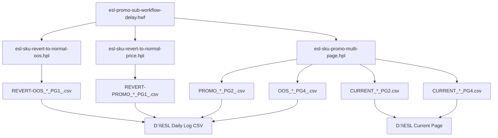

#### 19\.3\.10 Operational Interpretation

The two directories serve different purposes:

```Plain Text
D:\ESL Current Page
```

should be treated as a current\-state operational snapshot\.

It answers questions such as:

```Plain Text
Which labels are currently represented as Page 2?
Which labels are currently represented as Page 4?
```

By contrast:

```Plain Text
D:\ESL Daily Log CSV
```

should be treated as a historical action log\.

It answers questions such as:

```Plain Text
Which ESLs were changed to promotion mode?
Which ESLs were marked out of stock?
Which ESLs were reverted from OOS?
Which ESLs were reverted from promotion to normal pricing?
When did those actions occur?
```

---

# 20\. Variables and Parameters

## 20\.1 `STORE_CODE_PARAM`

Primary store\-scoping variable is used throughout the solution\.

Origin:

```Plain Text
master pipeline SQL field STORE_CODE/store_code
        ↓
Workflow Executor variable mapping
        ↓
STORE_CODE_PARAM
```

It is propagated through parent/child workflows and used in:

- SQL Server `WHERE store_code = ...` predicates;

- AIMS PostgreSQL `station_code = ...` predicates;

- output filenames;

- AIMS Dashboard REST URL query parameters\.

---

## 20\.2 `LIST_ITEM_CODE_DIFF`

Created by:

```Plain Text
esl-compare-diff.hpl
```

Scope:

```Plain Text
ROOT_WORKFLOW
```

Purpose:

- holds a SQL\-ready comma\-separated list of item codes classified as `new` or `changed`;

- consumed by `esl-sku-update-to-csv.hpl`\.

Example:

```Plain Text
'100001','100002','100003'
```

No\-change sentinel:

```Plain Text
'__NO_DATA__'
```

---

## 20\.3 `PARAM_STORE_CODE`

Observed only in the Page 3 REST URL:

```Plain Text
${PARAM_STORE_CODE}
```

This is inconsistent with the rest of the design and should be treated as a configuration item requiring confirmation\.

# 21\. Database Connection Aliases

| **Hop connection name**                | **Known usage**                                                                                               |
| -------------------------------------- | ------------------------------------------------------------------------------------------------------------- |
| `DB ESL Product`                       | SQL Server product, stock, promo and store queries                                                            |
| `DB AIMS PORTAL (ESL ID - Product ID)` | AIMS article, label mapping and device page state                                                             |
| `DB AIMS CORE (Template Page Type)`    | Checked by `esl-sku-update-daily-new.hwf`; not directly queried by the supplied child pipelines reviewed here |

The architecture sketch also lists PostgreSQL databases including names such as AIMS Portal, Core and OTA\. The exact physical database mapping of each Hop connection should be captured from Hop metadata or JDBC connection properties in a future revision\.

---

# 22\. End\-to\-End SKU Synchronization Sequence

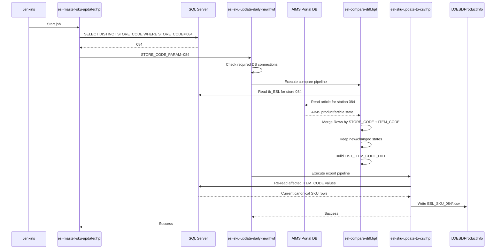

---

# 23\. End\-to\-End Promotion/Page Sequence

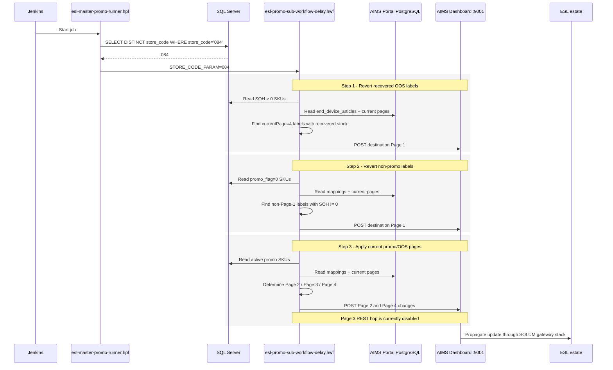

---

# 24\. Operational Behavior and Failure Handling

## 24\.1 Parent workflow failure behavior

The SKU workflow explicitly aborts when:

- required database connectivity fails;

- `esl-compare-diff.hpl` fails;

- `esl-sku-update-to-csv.hpl` fails\.

The promotion workflow explicitly aborts on failure hops configured after the price\-reversion and promo\-multi\-page pipelines\. Because child pipeline actions use `wait_until_finished = Y`, a failed child can block progression to later steps rather than allowing the workflow to race ahead\.

---

## 24\.2 Idempotency protections

Several implementation choices reduce unnecessary repeated work:

1. SKU updates are exported only for `new` / `changed` items\.

2. Page update branches check `currentPage != destinationPage` before sending REST requests\.

3. OOS reversion requires stock recovery \(`SOH > 0`\)\.

4. Normal\-price reversion excludes `SOH = 0` items\.

These mechanisms improve repeatability, but they do not constitute full transaction\-level idempotency; duplicate job execution, partial REST success, or filesystem reprocessing still require operational consideration\.

---

# 25\. Important Findings / Technical Debt

## 25\.1 Hardcoded store `084`

Both top\-level master pipelines currently use:

```SQL
WHERE STORE_CODE = '084'
```

or equivalent casing\.

> The architecture clearly supports parameterized per\-store processing, but the current runtime scope is deliberately or temporarily limited to store `084`\.

### Recommendation

Before removing the filter, validate:

- Jenkins concurrency;

- Hop Workflow Executor behavior for multiple rows;

- AIMS API throughput and rate handling;

- output filename uniqueness;

- database load;

- gateway/store isolation;

- failure containment per store\.

---

## 25\.2 Selective SKU comparison fields

The diff pipeline exports many fields but only compares a subset\.

Potentially non\-detecting examples include changes to:

- `ITEM_NAME`

- `ITEM_SHORTNAME`

- `MEMBER_PRICE`

- taxonomy/classification fields;

- `NFC_URL`

- `PRODUCT_URL`

- some promo descriptive attributes\.

### Risk

> An AIMS article can become stale for a field that is not in the Merge Rows value list while the pipeline still classifies the row as `identical`\.

### Recommendation

> Create a formal matrix distinguishing:
>
> - fields that affect physical label rendering;
> - fields that must trigger AIMS synchronization;
> - fields that are informational only\.

Then align the Merge Rows value list with that contract\.

---

## 25\.3 Deleted products are ignored

`diff_status = deleted` is routed to a dummy transform\.

### Risk

A product removed from SQL Server but still present in AIMS may remain in AIMS unless another process handles deletion/unassignment\.

### Recommendation

Confirm the intended lifecycle for:

- SKU deletion;

- product deactivation;

- label unassignment;

- discontinued products;

- store assortment changes\.

---

## 25\.4 Page 3 is disabled and uses inconsistent variable name

Current facts:

- Page 3 branch exists;

- Page 3 JSON is generated;

- the hop to `REST client PG 3` is disabled;

- the REST URL uses `${PARAM_STORE_CODE}` rather than `${STORE_CODE_PARAM}`\.

### Recommendation

> Treat Page 3 as **not production\-active** until confirmed\. If it is intended to be enabled, correct and test the variable mapping before activation\.

---

## 25\.5 Current\-page state filter inconsistency

The two Page\-1 reversion pipelines filter current device rows with:

```Plain Text
a.state = 'SUCCESS'
```

The promo\-multi\-page current\-page query contains commented state conditions\.

### Risk

> Promo logic can potentially include stale, timeout, failed, or otherwise non\-success device states\.

### Recommendation

> Document the intended AIMS `enddevice.state` semantics and use an explicit state policy consistently across all page\-management pipelines\.

---

## 25\.6 HTTP endpoint is unencrypted

The configured AIMS Dashboard endpoint is:

```Plain Text
http://192.168.85.213:9001/...
```

This is HTTP rather than HTTPS\.

If all communication is host\-local or confined to a protected management VLAN, the practical risk may be limited, but the deployment should still document:

- service binding interface;

- firewall rules;

- whether authentication is required;

- whether TLS is supported;

- which processes/users are permitted to access port `9001`\.

---

## 25\.7 REST API uses a query\-string store parameter with embedded quotes

Current form:

```Plain Text
?store='${STORE_CODE_PARAM}'
```

The single quotes are part of the configured URL string\.

This may be required by the AIMS Dashboard service implementation, but it is unusual for ordinary query\-parameter conventions\. Preserve it until validated against the API contract\.

---

## 25\.8 Filesystem integration is operationally important

Several workflows depend on local paths under `D:\ESL...`\.

Operational dependencies include:

- drive availability;

- folder permissions for the Jenkins/Hop service account;

- disk capacity;

- file retention;

- antivirus/EDR file locking;

- downstream file consumer behavior;

- backup or archival policy\.

These should be treated as production dependencies, not merely debug outputs\.

---

# 26\. Recommended Monitoring

At minimum, production monitoring should cover:

## Jenkins

- job start/end status;

- execution duration;

- consecutive failure count;

- overlap/concurrent execution;

- last successful run\.

## Apache Hop

- child workflow exit status;

- row counts from SQL and AIMS inputs;

- `new`, `changed`, `deleted`, `identical` counts;

- REST response status and response body;

- number of attempted page changes by page;

- malformed JSON / parse failures;

- SQL exceptions\.

## SQL Server

- `tb_ESL` freshness;

- upstream `dbo.RefreshESL_New` completion;

- row counts by store;

- promo date validity;

- invalid/blank `ITEM_CODE` or `STORE_CODE`;

- abnormal SOH values\.

## AIMS PostgreSQL

- `article` row freshness;

- `end_device_articles` orphan mappings;

- labels without articles;

- article IDs without labels;

- `enddevice.state` distribution;

- invalid `pages` JSON\.

## AIMS Dashboard API

- port `9001` reachability;

- HTTP status code distribution;

- latency;

- failures by store;

- rejected label codes;

- partial\-batch errors\.

## Filesystem

- free disk space;

- age/count of files in `D:\ESL\ProductInfo`;

- age/count of daily logs;

- file consumer backlog;

- stale current\-page files\.

---

# 27\. Troubleshooting Runbook

## 27\.1 Jenkins job failed before any Hop processing

Check:

1. Jenkins console output;

2. Hop executable/run configuration path;

3. project/environment selection;

4. service\-account permissions;

5. whether a prior execution is still running\.

---

## 27\.2 SKU updater stops at DB check

Validate Hop connections:

```Plain Text
DB AIMS PORTAL (ESL ID - Product ID)
DB ESL Product
DB AIMS CORE (Template Page Type)
```

Check:

- DNS/IP reachability;

- TCP ports;

- JDBC driver;

- credential validity;

- SQL/PostgreSQL login permissions;

- database availability\.

---

## 27\.3 SKU changed in SQL Server but no CSV is generated

Investigate in this order:

1. Confirm store is `084` or otherwise included by the master query\.

2. Confirm `ITEM_CODE` exists in `tb_ESL`\.

3. Compare the SQL and AIMS article values\.

4. Check whether the changed attribute is included in the Merge Rows comparison list\.

5. Inspect `diff_status`\.

6. Inspect `LIST_ITEM_CODE_DIFF`\.

7. Check if it became `'__NO_DATA__'`\.

8. Validate `D:\ESL\ProductInfo` permissions and disk space\.

A particularly important case is a change only to a non\-compared field; the pipeline may legitimately produce no update under the current design\.

---

## 27\.4 Label is stuck on Page 4 although stock recovered

Check:

1. `tb_ESL.SOH > 0` for the product;

2. product\-to\-label mapping in `end_device_articles`;

3. `enddevice.state = 'SUCCESS'`;

4. `enddevice.pages.currentPage` is actually `4`;

5. merge\-join ordering/input data;

6. REST request to Page 1;

7. AIMS Dashboard API response;

8. Newton Gateway connectivity;

9. physical label communication state\.

---

## 27\.5 Label remains on promotion after promo ends

Check:

1. `PROMO_FLAG` is actually set to `0` by the upstream source;

2. SOH is not `0`;

3. The current page differs from Page 1;

4. label mapping is valid;

5. Page\-1 REST request was generated;

6. API/gateway delivery succeeded\.

---

## 27\.6 Percent\-based promotion does not change the label

The current Hop file contains a likely explanation by design/configuration:

```Plain Text
Enhanced JSON Output PAGE 3 → REST client PG 3
```

is disabled\.

Also verify the inconsistent variable:

```Plain Text
${PARAM_STORE_CODE}
```

Before enabling Page 3, confirm the intended production design and test in a controlled store/label scope\.

---

# 28\. Recommended Future Documentation Additions

The following information is not fully contained in the supplied Hop files and should be added in a later revision:

1. Jenkins job names, schedules and command lines\.

2. Apache Hop version, project and environment names\.

3. Hop execution user / Windows service account\.

4. JDBC connection hosts, ports and database names\.

5. Exact SQL Server role of `dbo.RefreshESL_New`\.

6. The consumer of `D:\ESL\ProductInfo\ESL_SKU_*.csv`\.

7. Gateway Launcher version and precise runtime role\.

8. Newton Gateway network path, ports and redundancy model\.

9. AIMS Dashboard API authentication requirements\.

10. Page template IDs/layout definitions behind Pages 1–4\.

11. Store\-to\-gateway topology\.

12. Error retry policy and backoff behavior\.

13. Expected transaction volumes and performance targets\.

14. File retention policy\.

15. Disaster recovery and rebuild procedure\.

---

# 29\. Recommended Logical Ownership Model

A clean system\-of\-record model should be documented explicitly\.

| **Data / responsibility**     | **Recommended owner**                        |
| ----------------------------- | -------------------------------------------- |
| Product master / SKU          | Enterprise ERP / product master / SQL source |
| Stock on hand                 | Inventory / retail transactional system      |
| Price                         | Pricing / ERP / POS master                   |
| Promotion dates and mechanics | Promotion/pricing source system              |
| ESL article representation    | AIMS                                         |
| Product\-to\-label assignment | AIMS                                         |
| Current physical ESL page     | AIMS/device state                            |
| ETL orchestration             | Apache Hop                                   |
| Scheduling                    | Jenkins                                      |
| RF delivery to ESL            | Newton Gateway / SOLUM stack                 |

Apache Hop should remain an **integration/orchestration layer**, not the authoritative source for retail master data\.

---

# 30\. High\-Level Data Flow Summary

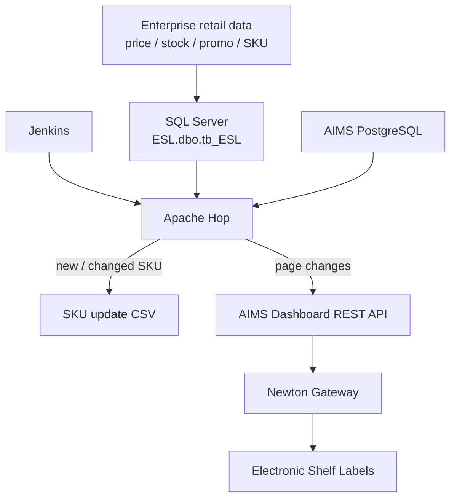

---

# 31\. Current\-State Summary

The current implementation can be summarized as follows:

- Jenkins launches two master Apache Hop pipelines\.

- Both master pipelines currently process only store `084`\.

- The SKU branch compares SQL Server product data with AIMS Portal article data\.

- Only `new` and `changed` SKUs are exported\.

- A root\-workflow variable, `LIST_ITEM_CODE_DIFF`, passes changed item codes between pipelines\.

- The resulting product payload is written to `D:\ESL\ProductInfo` as CSV\.

- The promotion branch manages label pages through three sequential stages:
  1. OOS recovery → Page 1;

  2. non\-promo recovery → Page 1;

  3. active promo/OOS application → Page 2 / Page 3 / Page 4\.

- Page 2 and Page 4 REST calls are active\.

- Page 3 REST execution is currently disabled and uses a different store variable name\.

- AIMS Portal PostgreSQL provides product/article state, product\-to\-label mapping, and current page state\.

- Apache Hop directly posts page changes to the local AIMS Dashboard service at `192.168.85.213:9001`\.

- Local CSV files provide product integration output and operational audit/current\-state records\.

---

# 32\. Open Questions for the Next Review

The following questions should be resolved before finalizing the production architecture document:

1. What application/process consumes `D:\ESL\ProductInfo\ESL_SKU_*.csv`?

2. Does Gateway Launcher participate continuously in production page delivery, or only in provisioning/configuration?

3. What exactly does `dbo.RefreshESL_New` do, and how is it scheduled relative to Jenkins?

4. Is Page 3 intentionally disabled?

5. Should `PARAM_STORE_CODE` be replaced by `STORE_CODE_PARAM` if Page 3 is enabled?

6. Which additional SKU fields should trigger an AIMS update?

7. What is the intended behavior for `deleted` products?

8. Should the promo current\-page query restrict `enddevice.state`?

9. How should failures be retried without producing duplicate or conflicting page actions?

10. When the solution expands beyond store `084`, should stores run sequentially or in controlled parallelism?

---

## Appendix A — File Dependency Matrix

| **Parent**                         | **Child**                            | **Relationship**                           |
| ---------------------------------- | ------------------------------------ | ------------------------------------------ |
| Jenkins                            | `esl-master-sku-updater.hpl`         | Scheduled/triggered entry point            |
| `esl-master-sku-updater.hpl`       | `esl-sku-update-daily-new.hwf`       | Workflow Executor                          |
| `esl-sku-update-daily-new.hwf`     | `esl-compare-diff.hpl`               | Sequential child pipeline                  |
| `esl-sku-update-daily-new.hwf`     | `esl-sku-update-to-csv.hpl`          | Sequential child pipeline after comparison |
| Jenkins                            | `esl-master-promo-runner.hpl`        | Scheduled/triggered entry point            |
| `esl-master-promo-runner.hpl`      | `esl-promo-sub-workflow-delay.hwf`   | Workflow Executor                          |
| `esl-promo-sub-workflow-delay.hwf` | `esl-sku-revert-to-normal-oos.hpl`   | First display\-state pipeline              |
| `esl-promo-sub-workflow-delay.hwf` | `esl-sku-revert-to-normal-price.hpl` | Second display\-state pipeline             |
| `esl-promo-sub-workflow-delay.hwf` | `esl-sku-promo-multi-page.hpl`       | Third display\-state pipeline              |

---

## Appendix B — Known Paths and Endpoints

```Plain Text
SQL Server / source table:
  ESL.dbo.tb_ESL

AIMS Portal tables:
  article
  end_device_articles
  enddevice

AIMS page-change API:
  http://192.168.85.213:9001/dashboardservice/common/labels/page

Product output:
  D:\ESL\ProductInfo\

Daily action logs:
  D:\ESL Daily Log CSV\

Current-page snapshots:
  D:\ESL Current Page\
```

---

## Appendix C — Known Page Mapping

```Plain Text
Page 1 = Normal / regular price
Page 2 = Fixed-price promotion
Page 3 = Percent-based promotion (REST hop currently disabled)
Page 4 = Out of stock
```

---

## Appendix D — Change Detection Field Matrix

| **Field**                          | **Read/exported** | **Used to determine \*\***`changed`\*\*       |
| ---------------------------------- | ----------------- | --------------------------------------------- |
| STORE_CODE                         | Yes               | Key                                           |
| ITEM_CODE                          | Yes               | Key \+ value list                             |
| BARCODE                            | Yes               | Yes                                           |
| ITEM_NAME                          | Yes               | No                                            |
| ITEM_SHORTNAME                     | Yes               | No                                            |
| SALES_PRICE                        | Yes               | Yes                                           |
| DISC_PRICE                         | Yes               | Yes                                           |
| DISC_PERCENT                       | Yes               | No                                            |
| DISC_TEXT                          | Yes               | No                                            |
| MEMBER_PRICE                       | Yes               | No                                            |
| SOH                                | Yes               | Yes                                           |
| PROMO_FLAG                         | Yes               | Yes                                           |
| REDLIST                            | Yes               | Yes                                           |
| PROMO_START_DATE                   | Yes               | Yes                                           |
| PROMO_END_DATE                     | Yes               | Yes                                           |
| PROMO_START_TIME                   | Yes               | Yes                                           |
| PROMO_END_TIME                     | Yes               | Yes                                           |
| Remaining selected metadata fields | Yes               | No, based on current Merge Rows configuration |

---
